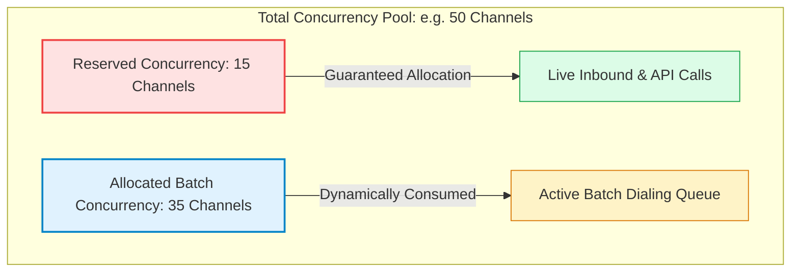

## What is a batch call and when should you use it?

A **batch call** is an automated outbound telephony campaign that executes high-volume phone calls to a structured recipient list using Tavly AI voice agents. It is designed for mass customer outreach—such as appointment reminders, payment follow-ups, and surveys—injecting personalized CSV data into dynamic agent prompts while managing concurrency automatically.

Rather than invoking standalone API calls per recipient, the batch calling framework allows teams to organize thousands of outbound communications into a unified, monitorable campaign. 

| Deployment Scenario | Recommended Delivery Architecture | Data Injection Method |
| :--- | :--- | :--- |
| **Bulk Customer Outreach** (100–100,000+ contacts) | **Batch Calls**: Grouped scheduling with reserved concurrency | Multi-column CSV file upload |
| **Event-Triggered Outbound Calls** (Cart abandonment, 2FA) | **[Create Phone Call API](/deploy/outbound-calls)**: Single real-time call requests | REST API JSON payload |
| **Inbound Call Centers** | **[Inbound Telephony](/deploy/purchase-number)**: Always-on phone numbers | Telephony SIP trunks / Webhooks |

---

## How do you create and configure a batch call campaign?

To **create and configure a batch call campaign**, navigate to the Batch Call tab, click Create Batch Call, define a unique campaign name, and select an outbound phone number. Next, upload a recipient CSV with personalized variables, configure active time windows, allocate reserved concurrency slots, and trigger or schedule execution.

Follow these step-by-step instructions in the Tavly dashboard to initiate a campaign:

<Steps>
  <Step title="Initialize the batch call">
    Navigate to the **Batch Call** tab in the Tavly AI dashboard and click **Create Batch Call** in the top-right corner.

    <Frame caption="The Batch Call dashboard overview and Create Batch Call button.">
      
    </Frame>
  </Step>

  <Step title="Define campaign identity and originating phone number">
    * Assign a descriptive, unique name to differentiate the campaign within operational logs.
    * Select an authorized originating **From Number** from the dropdown menu.
    * Ensure the selected number is properly bound to an active AI voice agent.
  </Step>

  <Step title="Upload recipient CSV and define schema mappings">
    Prepare a CSV spreadsheet containing a mandatory `phone number` column. Download the sample template or upload your custom data file:

    <Frame caption="Batch call configuration panel for agent selection and CSV upload.">
      
    </Frame>
  </Step>

  <Step title="Configure regulatory time windows">
    Open the time window modal to define permissible calling hours, preventing outreach outside acceptable daylight hours.

    <Frame caption="Batch Call Time Window Configuration modal.">
      
    </Frame>
  </Step>

  <Step title="Allocate reserved concurrency thresholds">
    Under **Reserved Concurrency for Other Calls**, define the number of concurrent channels to safeguard for real-time inbound traffic or priority API calls. The batch processor operates strictly on remaining channels:
    $$\text{Batch Concurrency} = \text{Total Account Concurrency} - \text{Reserved Concurrency}$$
  </Step>

  <Step title="Execute or schedule outreach">
    * Select **Send Now** to initiate dialing immediately as concurrency permits, or **Schedule** for future delivery.
    * Click **Save as Draft** to preserve configuration for review, or **Send** to queue calls.
  </Step>
</Steps>

---

## How do you structure the recipient CSV file and dynamic variables?

To **structure the recipient CSV file**, provide a header row containing a mandatory phone number column in E.164 format. Additional columns automatically map to prompt variables like \{\{first_name\}\}, while optional reserved headers support per-recipient agent overrides, custom JSON metadata, SIP headers, and E.164 validation bypass flags for custom telephony.

### Supported CSV Schema Fields

| Column Header Name | Mandatory / Optional | Accepted Values & Format | Functional Purpose |
| :--- | :--- | :--- | :--- |
| `phone number` | **Mandatory** | E.164 formatted string (`+14155552671`) | Destination recipient phone number. |
| `[custom_variable]` | Optional | String, numeric, or boolean | Injected into agent prompts as `{{custom_variable}}`. |
| `override agent id` | Optional | Valid Tavly Agent ID string | Assigns an alternative voice agent to this specific recipient. |
| `override agent version` | Optional | Valid Version string (`V2`, `V3`) | Pins this call to a specific immutable agent version. |
| `metadata` | Optional | Escaped JSON string (`{"crm_id":"123"}`) | Attached to call records and queryable via APIs. |
| `custom_sip_headers` | Optional | Escaped JSON starting with `X-` | Passes custom headers through enterprise SIP trunks. |
| `ignore e164 validation` | Optional | `true` or `false` | Bypasses E.164 format checks (**custom telephony only**). |

<Frame caption="Sample CSV structure illustrating custom dynamic variables and the ignore e164 validation flag.">
  
</Frame>

<Warning>
  The `ignore e164 validation` column is valid exclusively when utilizing [Custom Telephony / SIP Trunks](/deploy/custom-telephony). When utilizing Tavly native telephony, all destination numbers must strictly adhere to the international E.164 format (`+[CountryCode][SubscriberNumber]`).
</Warning>

---

## How do you schedule time windows and manage reserved concurrency?

To **schedule time windows and manage reserved concurrency**, specify permitted calling hours in the time window modal to ensure regulatory compliance across recipient timezones. Allocate reserved concurrency slots to protect inbound lines, allowing the batch engine to dial using remaining capacity as slots become available.

Batch dialing operates within two protective boundaries:



### Operational Rules

* **Reserved Concurrency Constraints**: The reserved value must be at least **1** and cannot exceed your **total concurrency limit minus 1**, ensuring that your contact center never exhausts inbound capacity.
* **Automatic Pacing**: There is no manual inter-call delay parameter. Calls are placed continuously as concurrency slots become free. If account calls-per-second (CPS) thresholds are reached, pending attempts are queued rather than dropped.
* **Time Windows**: Setting start and stop hours ensures agents only place calls within permissible TCPA contact hours.

---

## How do you monitor batch metrics and retrieve individual call IDs?

To **monitor batch metrics and retrieve individual call IDs**, track real-time campaign statuses—Draft, Planned, Ongoing, and Sent—alongside pickup and completion rates in the console. For programmatic retrieval of transcripts and recordings, query the List Calls API filtered by the unique batch_call_id returned upon submission.

### Lifecycle Status Classifications

* **Draft**: Fully editable campaign configuration. No outbound calls will be placed until officially submitted.
* **Planned**: Scheduled for execution at a designated future time window. Configuration is locked.
* **Ongoing**: Actively dialing recipients as allocated concurrency slots open up.
* **Sent**: All numbers in the batch have been dialed and completed.

<Frame caption="Batch call tracking table displaying campaign status, pickup rates, and completion metrics.">
  
</Frame>

### Detailed Call Auditing

Click the history icon next to any campaign entry to review granular details for each recipient, including call duration, disconnection reasons, and dynamic variables:

<Frame caption="Individual call logs within a selected batch campaign.">
  
</Frame>

### Querying Individual Calls via API

The [Create Batch Call API](/api-references/create-batch-call) returns an aggregate `batch_call_id`. To fetch transcripts, audio recordings, or post-call extracted variables for individual conversations, query the [List Calls API](/api-references/list-calls) with a filter payload:

```json filter_criteria.json theme={"dark"}
{
  "filter_criteria": {
    "batch_call_id": {
      "type": "string",
      "op": "eq",
      "value": "batch_call_dbcc4412483ebfc348abb"
    }
  }
}
```

The response returns an array of complete call objects. You can retrieve an exhaustive record for any call by passing its unique `call_id` to the [Get Call API](/api-references/get-call).

<Tip>
  To correlate calls with your internal CRM records, include a `metadata` JSON column in your CSV (e.g., `{"account_id": "acc_89231"}`). This data persists on the call record and is returned by both List Calls and Get Call endpoints.
</Tip>

---

## Frequently Asked Questions

<AccordionGroup>
  <Accordion title="Can I edit a batch call campaign after scheduling it?">
    Only while the batch remains in Draft status. Drafts are fully editable and do not trigger outbound activity. Once a batch is scheduled into Planned status, its contact list and settings are locked against further modification.
  </Accordion>

  <Accordion title="How do I inject different variables for each recipient?">
    Add custom columns to your recipient CSV. Any column not reserved by the platform is treated as a dynamic variable. For instance, a column named `appointment_time` can be interpolated into your prompt as `{{appointment_time}}`.
  </Accordion>

  <Accordion title="How do I obtain individual call IDs from a batch?">
    The Create Batch Call endpoint returns a single `batch_call_id`. To access individual `call_id` values, query the List Calls API with a filter matching `batch_call_id`.
  </Accordion>

  <Accordion title="Can I introduce a mandatory delay between each dialed call?">
    No. Dialing rate is dictated by account concurrency and the Reserved Concurrency for Other Calls threshold. When concurrent slots become vacant, the system automatically places the next queued call.
  </Accordion>
</AccordionGroup>

## Related Resources

* [Outbound call API reference](/deploy/outbound-calls): Trigger automated individual phone calls programmatically from your backend.
* [Concurrency and rate limits](/deploy/concurrency): Understand how concurrency quotas, pooling, and burst capacity operate.
* [Dynamic variables guide](/build/context/dynamic-variables): Format custom placeholders for prompt injection and CRM tool bindings.
* [Custom telephony integration](/deploy/custom-telephony): Route batch campaigns over private SIP trunks with custom headers.
