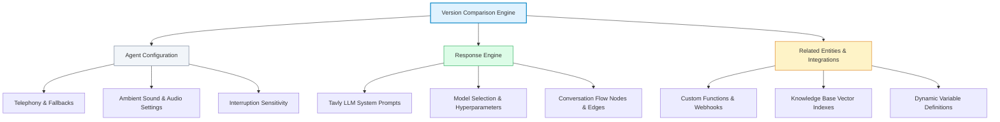

## What is agent version comparison and why should you use it?

**Agent version comparison** is a visual audit tool that displays side-by-side configuration differences between any two agent versions in Tavly AI. It enables teams to inspect system prompt revisions, conversational flow modifications, voice parameter adjustments, and tool integrations before promoting draft changes to production or investigating past regressions.

Maintaining high-performing voice agents requires rigorous change management. Without comprehensive visibility, subtle adjustments to prompt instructions, LLM parameters, or dynamic variable mappings can introduce unintended conversational side effects. Tavly's version comparison tooling provides deterministic audits across your entire agent stack, ensuring that every published release is verified and compliant.

Key operational benefits include:

* **Pre-Deployment Verification**: Validate exact prompt changes before executing production releases.
* **Audit and Compliance Logging**: Trace historical evolutions to understand when and why specific behavior rules changed.
* **Regression Root-Cause Analysis**: Quickly isolate the exact field or prompt line that caused a degradation in call completion rates.

---

## How do you access the version comparison modal?

To **access the version comparison modal**, click the clock icon in the agent header to open Version History, hover over a target version, and select Compare versions. Alternatively, click the Compare button inside the Publish modal to audit changes between your active draft and the latest published configuration.

Tavly provides two intuitive entry points to launch the side-by-side comparison modal:

<Steps>
  <Step title="Option 1: Access via Version History">
    1. Click the **Clock icon** in the upper-right header of your agent page to open the **Version History** panel.
    2. Locate any historical published version or draft.
    3. Hover over the version record and click **Compare versions**.
    4. The system automatically launches the diff modal comparing the selected version directly against your **current working draft**.
  </Step>

  <Step title="Option 2: Access via Publish Confirmation Dialog">
    1. Click **Publish** in the top-right corner of your agent screen when ready to finalize changes.
    2. Inside the confirmation modal, click the **Compare** button before confirming publication.
    3. Review the staged modifications between the last published release and your pending draft.
  </Step>
</Steps>

<Frame caption="The Version Comparison modal displaying side-by-side configuration differences between an active draft and a published version.">
  
</Frame>

---

## What are the comparison modes: Standard View versus Semantic Diff?

The **two comparison modes** provide complementary perspectives: Standard View renders a traditional two-column JSON schema diff highlighting structural syntax and parent hierarchies, while Semantic Diff delivers a human-readable summary categorizing additions, removals, and word-level text changes by field path for rapid prompt and parameter reviews.

| Feature / Capability | Standard View (JSON Diff) | Semantic Diff |
| :--- | :--- | :--- |
| **Primary Purpose** | Full schema inspection and structural debugging | Fast, scannable review of business logic and text |
| **Visual Layout** | Two-column split view with line-by-line alignment | Card-based field list grouped by change type |
| **Syntax Highlighting** | Full JSON syntax coloring with line numbers | Tagged badges (`+` Added, `−` Removed, `~` Changed) |
| **Prompt Inspection** | Raw multiline string differences | Word-level highlighting of inserted/deleted phrases |
| **Context Controls** | Toggleable **Show parent fields** option | Expandable and collapsible property blocks |

### Standard View (JSON Diff)

The standard view renders a traditional code diff displaying the complete JSON payload of both versions side by side.

<Frame caption="Standard View displaying a split-column JSON diff with color-coded syntax highlighting.">
  
</Frame>

**Core Capabilities:**
* **Split-Column Layout**: Aligns baseline and target configurations in parallel columns for granular line-by-line inspection.
* **Color-Coded Highlighting**: Clearly demarcates additions in green, deletions in red, and unchanged lines in neutral gray.
* **Show Parent Fields**: Toggle this setting to retain parent JSON keys (such as `response_engine` or `voice_settings`), providing structural context for isolated modifications.

### Semantic Diff

The semantic diff organizes modifications by entity and property name, providing an intuitive overview tailored for prompt engineers and product managers.

<Frame caption="Semantic Diff view showing grouped field paths, addition/removal counters, and word-level highlights.">
  
</Frame>

**Core Capabilities:**
* **Executive Change Summary**: Displays aggregate counters for additions (`+`), removals (`−`), and modifications (`~`) at the top of the interface.
* **Explicit Field Paths**: Displays exact dot-notation paths for every updated property (e.g., `response_engine.llm_id` or `voice_settings.speed`).
* **Word-Level Diffs**: Analyzes conversational system prompts to highlight exact inline words added, substituted, or deleted.
* **Expandable Payloads**: Collapses dense structures into clean summaries; click any element to expand and view the full payload.

<Tip>
  Use **Standard View** when validating technical schema parameters, verifying parent key nesting, or confirming API integrations. Use **Semantic Diff** when auditing prompt wording refinements or verifying conversational flow logic.
</Tip>

---

## What agent components and settings get compared?

During version comparison, Tavly audits **all core agent components**, including basic telephony settings, response engine parameters (such as Tavly LLM prompts, model choices, and temperature), conversational flow graphs and state machine transition rules, voice configurations, and linked external resources like custom webhooks and knowledge bases.

The diff engine inspects three main structural layers:

### Detailed Component Scope

* **Agent Configuration**:
  * Agent metadata, label, and language presets.
  * Speech recognition settings (e.g., speech-to-text model, interruption threshold, silence timeout).
  * Audio synthesis settings (e.g., voice provider, voice ID, speaking rate, temperature, ambient sound audio).
* **Response Engine**:
  * **Single/Multi-Prompt Agents**: Audits changes to the Tavly LLM prompt, model provider (`gpt-4o`, `claude-3-5-sonnet`, etc.), dynamic variable interpolations, and tool bindings.
  * **Conversation Flow Agents**: Audits flow graph topology, including added/removed prompt nodes, transition edge conditions, branch triggers, and fallback pathways.
* **Related Entities and Integrations**:
  * Linked knowledge base connections and retrieval top-k parameters.
  * Function tool definitions, custom webhook endpoints, and parameter schemas.
  * Post-call webhook URLs and analytics recording configurations.

---

## Frequently Asked Questions

<AccordionGroup>
  <Accordion title="Does the version comparison modal show diffs in real time as I type?">
    Yes. Your working draft saves continuously. Opening the comparison modal reflects the current draft state against whichever published or historical baseline version you selected.
  </Accordion>

  <Accordion title="Can I restore an older version from the comparison view?">
    While the comparison modal is designed for visual review, you can exit the modal, open the Version History panel, select any historical version, and click the option to branch a new draft from that version to restore past behavior.
  </Accordion>

  <Accordion title="Are changes to custom webhook code or knowledge base documents tracked?">
    The comparison modal tracks changes to the bindings and settings of knowledge bases and tools (such as tool name, parameter schema, or endpoint URL). However, raw document edits within an external knowledge base or code modifications on your external webhook server must be tracked within those respective external repositories.
  </Accordion>

  <Accordion title="Why do some prompt lines show as completely replaced instead of word-by-word?">
    If an entire paragraph or prompt structure undergoes significant rewrites that exceed standard Levenshtein alignment thresholds, the semantic diff categorizes the modification as a block replacement rather than an inline word-level diff.
  </Accordion>
</AccordionGroup>

## Related Resources

* [Agent versions and environment tags](/deploy/agents/version): Learn how to draft, publish, and route traffic with immutable versions and tags.
* [Conversation flow builder](/build/setup/conversation-flow/conversation-flow-overview): Structure multi-step conversational state machines and node transitions.
* [Telephony number management](/deploy/purchase-number): Bind published versions and tags to inbound phone numbers.
* [LLM prompt engineering](/build/response/prompt-engineering-guide): Best practices for structuring deterministic system prompts.
