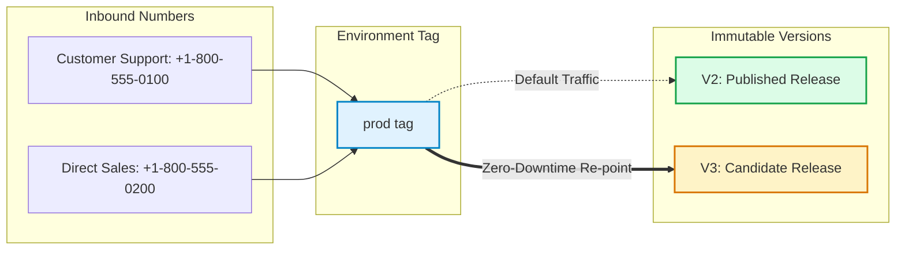

## What are Tavly AI agent versions and environment tags?

**Tavly AI agent versions and environment tags** provide structured lifecycle and deployment controls for voice AI applications. Versions preserve immutable snapshots of agent configurations, prompt engineering, and voice parameters, while environment tags decouple telephony endpoints from hardcoded versions to enable instant, zero-downtime promotions, rollbacks, and environment-specific variable overrides.

Deploying conversational AI in production requires balancing rapid iterative development with absolute runtime reliability. Tavly equips developers with dual mechanisms to control agent configurations:

* **Version Snapshots**: Incremental states capturing the exact state of prompts, LLMs, voice models, tools, and latency settings.
* **Environment Tags**: Dynamic aliases (such as `prod`, `staging`, or `dev`) that point to a chosen version, redirecting telephony traffic without modifying phone number configurations.

<iframe className="w-full aspect-video rounded-xl" src="https://www.youtube.com/embed/Bbz9TRzc2W4" title="How to Use Versioning and Environment Tags with Tavly AI" frameBorder="0" allow="accelerometer; autoplay; clipboard-write; encrypted-media; gyroscope; picture-in-picture" allowFullScreen />

---

## What is the difference between draft and published agent versions?

The difference between **draft and published agent versions** centers on mutability and operational stability. Drafts are fully editable, work-in-progress workspaces starting at V0 (draft), whereas publishing transforms a draft into an immutable, read-only version such as V2 that preserves exact system prompts, dynamic variables, and telephony behaviors for live production calls.

Every agent starts its lifecycle at **V0 (draft)**. As you iterate, the version index increments sequentially:

| Version State | Mutability | Production Readiness | Naming Format | Telephony Attachment |
| :--- | :--- | :--- | :--- | :--- |
| **Draft** | Fully editable | Intended for testing and staging validation | `V[N] (draft)` | Allowed (useful for test numbers) |
| **Published** | Read-only (immutable) | Recommended for live production traffic | `V[N]` | Recommended directly or via tags |

### Lifecycle Transition Rules

* **Incremental Numbering**: Version indices begin at **V0** and increment automatically whenever a new version is created.
* **Publishing Seal**: Clicking **Publish** strips the `(draft)` label, freezing the configuration permanently. For example, `V2 (draft)` transforms permanently into `V2`.
* **Branching New Work**: Because published versions are read-only, further prompt modifications require creating a new draft branched from that published state.
* **Phone Binding**: Both draft and published versions can be attached directly to [phone numbers](/deploy/purchase-number).

---

## How do you create, publish, and manage agent versions?

To **create, publish, and manage agent versions**, access the version panel in your agent header, select an existing release, and click the plus icon to branch a new draft. After testing your draft with phone or web simulations, click Publish to permanently commit the configuration as an immutable release.

To access the version drawer in the Tavly dashboard, click the version button located in the top-right corner of the agent configuration page:

<Frame caption="The version selector button located in the upper right header of the agent dashboard.">
  
</Frame>

The drawer separates configurations into two categories: **Draft** and **Published**. Selecting any version opens its prompt and voice configuration. Draft entries display ancestral lineage (e.g., *"Created from V1"*), enabling you to trace changes back to their source:

<Frame caption="The versions drawer categorizing drafts and published versions with creation lineage.">
  
</Frame>

### Version Operations

<Steps>
  <Step title="Create a new draft">
    Select the baseline version you wish to branch from in the panel, then click **+** (Add Draft). Tavly duplicates the configuration into an isolated, editable draft. You can maintain multiple concurrent drafts to experiment with alternate prompts or voices simultaneously. Test your draft using [Test Phone Calls](/test/test-phone) before promoting.
  </Step>

  <Step title="Publish a draft">
    Select the draft in the versions drawer, click **Publish** in the upper right corner of the agent page, and confirm your selection in the modal dialog. Publishing is instantaneous and irreversible.

    <Frame caption="Confirming publication of an agent draft in the publish dialog.">
      
    </Frame>
  </Step>

  <Step title="Delete obsolete versions">
    Open the versions panel, select the target version, and select the delete option. If deleting a published version currently associated with live phone numbers or environment tags, reassign or detach those dependencies before deleting.
  </Step>
</Steps>

---

## What are environment tags and how do they decouple deployments?

**Environment tags** are named pointers—such as prod, staging, or dev—that map dynamically to specific agent versions. By assigning inbound phone numbers or outbound campaigns to a tag rather than a static version number, operators can roll out updates or execute immediate rollbacks across hundreds of telephony numbers with a single click.

Directly assigning phone numbers to version numbers introduces operational friction: upgrading an agent requires manually editing each phone number's routing setting. Environment tags resolve this by providing an indirection layer:

### Tag Characteristics

* **Preconfigured Tags**: Every agent is automatically provisioned with default `prod` and `staging` tags.
* **Many-to-One Tagging**: Multiple tags can point to the same version simultaneously (e.g., both `prod` and `staging` pointing to `V2`).
* **Zero-Downtime Rollbacks**: If an issue occurs in `V3`, moving the `prod` tag back to `V2` instantly reverts all phone numbers attached to that tag.

<Frame caption="The Environment Tags info modal displaying current version associations and assigned tags.">
  
</Frame>

---

## How do you configure environment tags and dynamic variable overrides?

To **configure environment tags and dynamic variable overrides**, open the Environment menu in the agent header and select Configure Tags to create up to ten custom tags. You can assign environment-specific dynamic variable values, allowing staging numbers to route transfer calls to test destinations while production routes to live teams.

To manage your environment tags and customize runtime parameters:

### Step 1: Open Tag Configuration
Click **Environment** in the agent header, then select **Configure Tags**. You can edit existing tags or click **+ Add** to register new environments. Each agent supports up to **10 environment tags** (including defaults).

<Frame caption="The Configure Tags modal allowing operators to add tags and configure environment-specific dynamic variable values.">
  
</Frame>

### Step 2: Override Dynamic Variables per Environment
Tags support environment-scoped values for [dynamic variables](/build/context/dynamic-variables):

* **Call Transfer Destinations**: Set a transfer variable to a developer's mobile number under `staging`, and to a live call center PBX under `prod`.
* **API Endpoints**: Point webhooks or integration endpoints to sandbox URLs in `staging` and production servers in `prod`.
* **Prompt Variations**: Inject environment-specific test indicators without modifying the underlying agent configuration.

### Step 3: Assign or Relocate Tags
In the versions panel, select the version you wish to bind. Click **Environment** in the agent header, select the target tag, and the tag indicator will attach beside that version:

<Frame caption="Selecting and binding environment tags to specific agent versions in the versions drawer.">
  
</Frame>

<Tip>
  Moving an environment tag automatically redirects all phone numbers linked to that tag. Numbers directly bound to a static version ID (e.g., `V2`) remain on that version regardless of tag reassignments.
</Tip>

---

## Frequently Asked Questions

<AccordionGroup>
  <Accordion title="What happens to active phone calls when an environment tag is moved?">
    Active, in-progress voice calls continue executing on the exact agent version they began with until termination. Only new incoming or outbound calls placed after the tag reassignment are routed to the newly targeted version.
  </Accordion>

  <Accordion title="Can I test multiple drafts simultaneously?">
    Yes. You can create multiple independent drafts from any historical version and bind test phone numbers or web call simulators to each draft to evaluate alternative prompt instructions side-by-side.
  </Accordion>

  <Accordion title="How do dynamic variable overrides interact with API-injected variables?">
    Dynamic variables specified within an environment tag act as default fallback values for calls utilizing that tag. If custom dynamic variables are explicitly passed in an API payload (such as in an outbound call request), the API values take precedence.
  </Accordion>

  <Accordion title="Can an immutable published version ever be edited?">
    No. Once a version is published, its settings, system prompt, and tools cannot be modified. To make alterations, create a new draft from the published version, apply your edits, and publish the new draft.
  </Accordion>
</AccordionGroup>

## Related Resources

* [Purchase and assign phone numbers](/deploy/purchase-number): Map incoming telephone numbers to environment tags or static versions.
* [Dynamic variables configuration](/build/context/dynamic-variables): Define prompt placeholders and runtime context variables.
* [Test phone calls](/test/test-phone): Validate draft agent behavior using live telephony before publishing.
* [A/B testing voice agents](/deploy/ab-testing): Distribute traffic between multiple agent configurations to measure conversion and performance.
