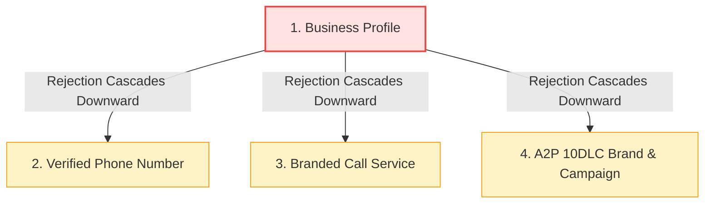

## Why do telephony verification and branded calling applications get rejected?

Telecommunications verification applications are **rejected by carrier vetting registries** when submitted corporate credentials fail strict algorithmic or manual compliance checks. Primary failure points include discrepancies between registered entity names and IRS tax filings, inaccessible corporate website domains, unverified virtual VoIP phone numbers, or character-limit violations in branded caller ID requests.

Carrier registries (such as The Campaign Registry and Aegis Mobile) conduct rigorous cross-referencing against federal and state databases. Even minor typographical errors between your dashboard entry and state records can prompt automated denials.

<Frame caption="A rejected telephony service alert displayed within the Tavly dashboard banner.">
  
</Frame>

---

## How does a business profile rejection cascade to downstream services?

A **business profile rejection cascades downward** across your entire telephony architecture. Because telecommunication compliance enforces strict parent-child verification trees, a failure at the foundational business profile level automatically invalidates associated phone number verifications, branded calling displays, and upstream A2P 10DLC SMS brand and campaign registrations until the root profile is resolved.

The compliance vetting structure operates hierarchically:

<Note>
  If your phone number is configured for both voice and SMS, a rejection at the [Business Profile](/deploy/calls/business-profile) level automatically flags your A2P 10DLC brand and campaigns as rejected. Always repair and resubmit the root business profile first, then re-verify downstream configurations following the [SMS campaign rejection procedures](/deploy/sms-campaign-application#if-your-campaign-is-rejected).
</Note>

---

## How do you inspect carrier rejection reasons in the Tavly dashboard?

To **inspect carrier rejection reasons**, navigate to the Phone Numbers page in your Tavly console, locate the affected phone line displaying a Rejected badge, and click the status label. The interface opens an audit drawer displaying the exact reviewer feedback and specific data fields requiring rectification.

Review reviewer feedback following these systematic steps:

<Steps>
  <Step title="Locate the rejected service in the dashboard">
    Navigate to the **Phone Numbers** inventory tab. Locate the targeted line where the **Verified Phone Number** or **Branded Call** service badge indicates a red `Rejected` status.

    <Frame caption="The Phone detail view showing a Rejected status badge on the Verified Phone service.">
      
    </Frame>
  </Step>

  <Step title="Open the detailed rejection diagnostic modal">
    Click directly on the **Rejected** status badge to launch the carrier diagnostic modal. The dialog presents the official telecommunication reviewer rationale:

    <Frame caption="Carrier rejection feedback modal detailing specific compliance issues.">
      
    </Frame>
  </Step>

  <Step title="Inspect business profile discrepancies">
    If the rejection references organizational identity mismatch, click your associated business profile link to review entity-level validation feedback:

    <Frame caption="Business Profile audit drawer displaying entity discrepancies and correction fields.">
      
    </Frame>
  </Step>
</Steps>

---

## How do you resolve discrepancies and resubmit your application?

To **resolve discrepancies and resubmit your application**, update the flagged records in your Business Profile—such as legal naming, EIN tax records, or public website domains—save the corrected profile, and click Resubmit on your Verified Phone Number or Branded Call panel to initiate automated carrier re-review.

### Common Rejection Reasons and Remediation Matrix

| Carrier Review Feedback | Underlying Root Cause | Precise Remediation Action |
| :--- | :--- | :--- |
| **"Legal Name / Tax ID Mismatch"** | Legal entity name differs from official IRS records. | Re-enter legal name exactly as shown on Form CP 575 or state registration. |
| **"Website Inaccessible or Incomplete"** | Website domain is offline, under construction, or lacks company identity. | Ensure website is live via `https://` and prominently displays the legal business name. |
| **"Invalid Contact Phone Number"** | Contact number is a VoIP line or unassigned number. | Provide a verified direct physical mobile or landline phone number. |
| **"Physical Address Not Verifiable"** | Address is a PO Box, virtual office, or commercial mail receiving agency. | Enter the physical commercial headquarters address registered with the state. |
| **"Branded Name Length Exceeded"** | Branded display exceeds carrier character limits. | Provide both Short Name ($\le 15$ chars for Verizon) and Long Name ($\le 32$ chars for AT&T/T-Mobile). |

### Resubmission Workflow

1. **Update Root Records**: Open [Business Profile](/deploy/calls/business-profile) and edit the fields identified by the carrier feedback. Click **Save**.
2. **Re-trigger Carrier Evaluation**: Return to your phone number's setup tab, open the [Verified Phone Number](/deploy/calls/verified-phone) or [Branded Call](/deploy/calls/branded-calls) application, and click **Resubmit**.
3. **Turnaround Window**: Carrier vetting agencies review corrected submissions within **3 to 5 business days**.

<Tip>
  Resubmitting a corrected application under the same business identity and use case is completely free of charge. You will receive an automated confirmation email once carrier approval completes.
</Tip>

---

## Frequently Asked Questions

<AccordionGroup>
  <Accordion title="Does an application rejection interrupt my active phone calls?">
    No. Inbound calls and standard unverified outbound calls continue to function normally. Rejection only prevents the application of premium verified STIR/SHAKEN trust badges or branded caller ID displays.
  </Accordion>

  <Accordion title="How many times can I edit and resubmit a rejected application?">
    There is no limit on resubmissions. You can update your business profile and re-apply as many times as necessary to satisfy upstream carrier compliance criteria.
  </Accordion>

  <Accordion title="Why was my business profile approved previously but rejected upon adding a new service?">
    Different telecommunications services enforce varying vetting stringencies. While basic profile setup uses automated registry lookups, branded calling and A2P messaging trigger manual reviewer audits that scrutinize website domains and corporate affiliations more rigorously.
  </Accordion>

  <Accordion title="What should I do if the rejection reason appears incorrect?">
    Verify that your government tax documentation (IRS CP 575 or Form 147C) perfectly matches your dashboard submission down to punctuation (e.g., "LLC" vs "L.L.C."). If discrepancies persist, contact Tavly support with supporting tax documents for escalation.
  </Accordion>
</AccordionGroup>

## Related Resources

* [Business profile setup guide](/deploy/calls/business-profile): Configure verified organizational credentials and tax IDs.
* [Verified phone numbers guide](/deploy/calls/verified-phone): Provision authenticated STIR/SHAKEN caller ID.
* [Branded calling configuration](/deploy/calls/branded-calls): Display verified enterprise names across mobile carriers.
* [SMS campaign rejection troubleshooting](/deploy/sms-campaign-application#if-your-campaign-is-rejected): Rectify opt-in workflows and sample messages for A2P 10DLC.
