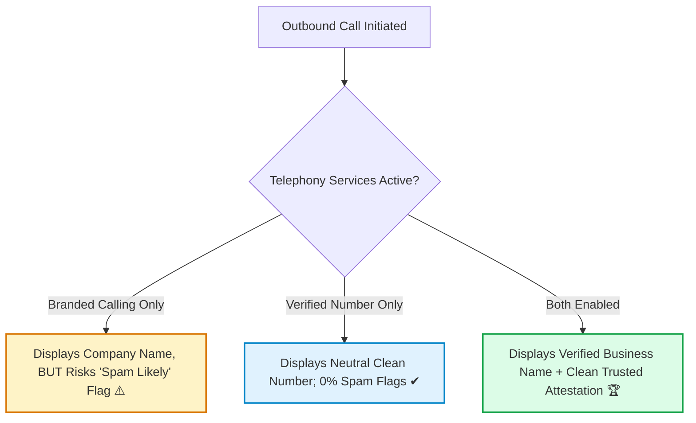

## What is branded calling and how does it improve pickup rates?

**Branded calling** is an advanced telephony feature that projects your verified business name directly onto customer mobile screens instead of displaying an unfamiliar telephone number. By replacing anonymous digits with authenticated enterprise identity, branded calling builds immediate recipient trust, minimizes caller screening, and significantly elevates outbound call connection rates.

In outbound call operations, customer answer rates drop precipitously when calls arrive from unknown numbers. Branded calling leverages carrier Rich Call Data (RCD) and advanced CNAM frameworks to present your verified corporate brand directly within native mobile call alerts.

<Frame caption="Recipient mobile handset displaying authenticated business branding instead of an unknown number.">
  
</Frame>

<Note>
  **Regional Eligibility**: Branded calling is currently supported exclusively for **United States local telephone numbers (10DLC)**. Non-US numbers and toll-free lines are not eligible.
</Note>

---

## Why is phone number verification recommended alongside branded calling?

Phone number verification is strongly recommended alongside branded calling because **they fulfill complementary regulatory functions**. While branded calling displays your organization's name, unverified numbers can still be flagged as Spam Likely by carrier algorithms. Combining both services guarantees that your authenticated brand appears without negative carrier spam warnings.

Carrier ecosystem displays operate across two distinct technical protocols:

* **[Verified Phone Number](/deploy/calls/verified-phone)**: Provides cryptographic STIR/SHAKEN Level-A attestation to suppress algorithmic spam warnings.
* **Branded Calling**: Replaces raw digits with verified alphanumeric text.

<Warning>
  Deploying branded calling without an active verified phone number may result in mobile devices showing your business name alongside an automated *"Spam Likely"* alert. Enable [Verified Phone Number](/deploy/calls/verified-phone) to maximize caller trust.
</Warning>

---

## How do you apply for branded calling on Tavly AI numbers?

To **apply for branded calling on Tavly AI numbers**, establish an approved business profile with verified legal entity credentials, select your target US telephone number under the Phone Numbers dashboard, attach your profile, specify short and long business name variations, and submit the application for carrier approval.

Follow these step-by-step instructions to configure branded caller ID:

<Steps>
  <Step title="Establish an approved business profile">
    Carrier vetting registries require proof of legal business incorporation. Follow the [Business Profile Guide](/deploy/calls/business-profile) to register your official legal entity name, Employer Identification Number (EIN), physical headquarters address, and authorized contact details.
  </Step>

  <Step title="Initiate the branded call application">
    1. In the Tavly console, navigate to your phone number's detail page.
    2. Under **Advanced Add-Ons**, select **Branded Call**.
    3. Choose your approved business profile from the dropdown menu.
    4. Input your desired business name displays for carrier propagation.

    <Frame caption="The Branded Call application modal in the Tavly dashboard.">
      
    </Frame>
  </Step>

  <Step title="Await carrier network provisioning">
    Telecom providers evaluate brand identity and register naming records across cellular databases. Review takes **1 to 2 weeks**. You will receive an automated email notification once branded calling is active.
  </Step>
</Steps>

---

## What are the carrier character limits and naming requirements?

Carrier character limits for branded caller ID vary across US telecom providers: **AT&T and T-Mobile permit up to 32 characters**, whereas **Verizon enforces a 15-character restriction**. Tavly enables operators to define both short and long branded names to ensure optimal, truncation-free display across every major cellular network.

### Carrier Display Specifications

| Wireless Carrier Network | Maximum Alphanumeric Length | Recommended Formatting Strategy |
| :--- | :--- | :--- |
| **AT&T Mobility** | **32 characters** | Full corporate brand name (e.g., `Acme Healthcare Support`) |
| **T-Mobile US** | **32 characters** | Full corporate brand name (e.g., `Acme Healthcare Support`) |
| **Verizon Wireless** | **15 characters** | Concise or abbreviated name (e.g., `Acme Health`) |

### Naming Compliance Rules

* **Direct Brand Alignment**: The display name must directly match or correlate with the legal business name or registered DBA stated in your approved [Business Profile](/deploy/calls/business-profile).
* **Dual Name Provisioning**: Always provide both a **Short Name** (under 15 characters) and a **Long Name** (up to 32 characters) in the configuration dialog. The telephony gateway automatically routes the appropriate string based on the terminating mobile operator.
* **Prohibited Characters**: Avoid emojis, excessive punctuation, and misleading terms such as *"IRS"* or *"Emergency"*.

---

## Frequently Asked Questions

<AccordionGroup>
  <Accordion title="Which telephone numbers are eligible for branded calling?">
    Branded calling is available exclusively for United States local phone numbers (10DLC). Toll-free numbers and international phone numbers cannot be registered for branded display.
  </Accordion>

  <Accordion title="How long does the branded calling application take to process?">
    Carrier vetting and wireless database propagation typically require 1 to 2 weeks. You will receive an email update once your branding is live.
  </Accordion>

  <Accordion title="Do I still need a verified phone number if I have branded calling?">
    Yes, they perform separate functions. Branded calling controls the text display, while a [Verified Phone Number](/deploy/calls/verified-phone) prevents carrier algorithmic spam flags. We strongly recommend enabling both simultaneously.
  </Accordion>

  <Accordion title="What should I do if my branded call application is rejected?">
    Review the exact carrier rejection reason in your phone number dashboard, update your business profile or name submission to address the reviewer feedback, and resubmit using [How to Handle a Rejection](/build/telephony/branded-call-rejection).
  </Accordion>

  <Accordion title="Can I cancel branded calling without interrupting active calls?">
    Yes. You can deactivate the branded call add-on at any time through the console without disconnecting phone lines or interrupting active voice routing. See [Stop Caller ID Service](/build/telephony/delete-service).
  </Accordion>
</AccordionGroup>

## Related Resources

* [Spam likely overview and call efficiency](/deploy/calls/spam-likely-overview): Discover how authenticated caller identity eliminates carrier spam suppression.
* [Verified phone number setup](/deploy/calls/verified-phone): Provision STIR/SHAKEN Level-A attestation for your outbound telephone numbers.
* [Business profile setup guide](/deploy/calls/business-profile): Configure and verify corporate entity credentials.
* [Handling application rejections](/build/telephony/branded-call-rejection): Troubleshoot and rectify carrier review errors.
