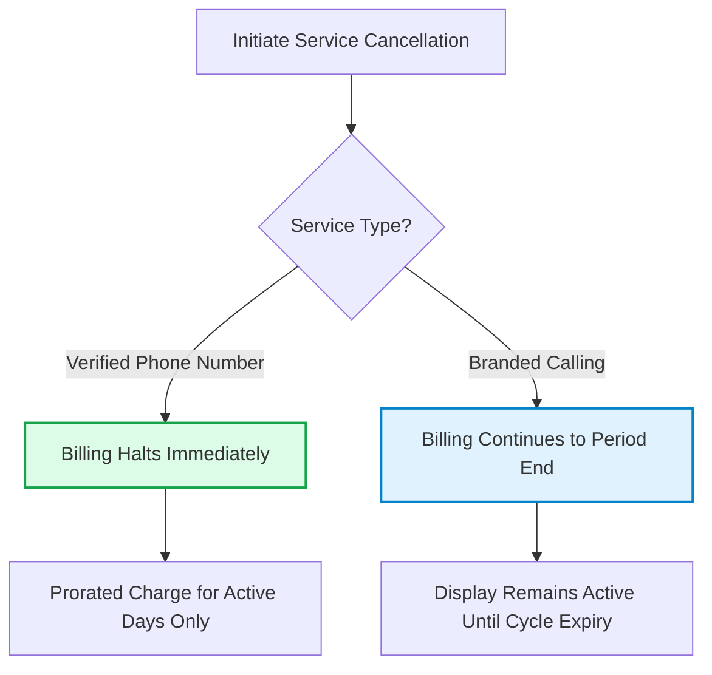

## What happens when you stop a caller ID service in Tavly AI?

When you **stop a caller ID service in Tavly AI**, the system de-registers the enhancement from carrier registries without disrupting your underlying telephony. Your voice agents continue placing and answering phone calls seamlessly; only the rich corporate name display or STIR/SHAKEN verified status is deactivated from outbound transmissions.

Both [Branded Calls](/deploy/calls/branded-calls) and [Verified Phone Numbers](/deploy/calls/verified-phone) operate as modular add-ons layered over your underlying telephony trunk. Because voice routing and caller ID management are decoupled, deactivating an add-on never disconnects a phone number or terminates active voice agent conversations.

<Frame caption="The Delete Service confirmation dialogue in the Tavly dashboard.">
  
</Frame>

---

## How do you stop branded calling or verified phone number services?

To **stop branded calling or verified phone number services**, navigate to your phone number's configuration page in the Tavly dashboard, locate the active service card under Advanced Add-Ons, and click the delete icon. Confirm the deprovisioning dialog to immediately unbind the carrier service record.

Follow these simple steps in the management console:

<Steps>
  <Step title="Navigate to your phone number settings">
    Open the **Phone Numbers** tab in the Tavly console and select the specific telephone number currently utilizing the add-on.
  </Step>

  <Step title="Select the service to deprovision">
    Under the **Advanced Add-Ons** section, locate the active service card for **Branded Call** or **Verified Phone Number**.
  </Step>

  <Step title="Confirm deactivation">
    Click the **Delete / Stop** action button on the service panel and confirm the modal prompt. Tavly transmits a de-registration event to upstream carrier gateways.
  </Step>
</Steps>

---

## What is the operational impact on outbound calls and caller displays?

The **operational impact on outbound calls** differs by service: stopping Branded Calling causes recipient devices to display standard numeric caller IDs instead of your business name, while stopping Verified Phone Numbers removes carrier whitelist attestation, potentially exposing your lines to renewed Spam Risk or Scam Likely flags.

| Telephony Add-On | Handset Behavior After Deletion | Underlying Call Handling | Carrier Whitelist Status |
| :--- | :--- | :--- | :--- |
| **[Branded Calls](/deploy/calls/branded-calls)** | Displays standard E.164 phone number without corporate name or logo | Continues uninterrupted | Alphanumeric CNAM and rich call data de-registered |
| **[Verified Phone Numbers](/deploy/calls/verified-phone)** | Displays standard phone number; risk of **Spam Likely** warnings resumes | Continues uninterrupted | STIR/SHAKEN Level-A whitelist record de-registered |

<Warning>
  **Re-Registration Notice**: If you plan to [re-register a verified phone number](/deploy/calls/verified-phone) at a later date, carrier vetting and database propagation require 1 to 2 weeks. Your numbers may face carrier throttling or negative spam tagging in the interim.
</Warning>

---

## How does billing differ between Branded Calls and Verified Numbers upon deletion?

**Billing policies upon deletion** differ by product: Verified Phone Numbers stop billing immediately with prorated invoicing for active days, whereas Branded Calling remains active and billed until the conclusion of your current monthly billing cycle, preserving branded display across carrier networks until the period ends.

### Deprovisioning Billing Terms

* **Verified Phone Numbers**: Invoicing ceases instantly upon deletion. Your account is billed only for the exact pro-rata proportion of the monthly billing cycle during which verification was active.
* **Branded Calling**: Telephony carrier contracts maintain month-to-month commitments. When cancelled, charges persist through the conclusion of your current billing period, and branded caller ID remains broadcast on outgoing calls until that date.

---

## Frequently Asked Questions

<AccordionGroup>
  <Accordion title="Will active, in-progress phone calls drop when I delete a service?">
    No. Deleting a caller ID add-on updates carrier registration records for subsequent calls. Active, in-progress voice conversations remain connected without disruption.
  </Accordion>

  <Accordion title="Does deleting a service remove my business profile?">
    No. Your legal [Business Profile](/deploy/calls/business-profile) remains securely stored in the dashboard and can be reused to register other numbers or A2P 10DLC messaging campaigns.
  </Accordion>

  <Accordion title="Can I re-activate a service after deleting it?">
    Yes. You can re-apply for verified numbers or branded calling at any time by selecting your approved business profile. Standard 1-to-2 week carrier vetting windows will apply.
  </Accordion>

  <Accordion title="Does stopping verification impact inbound call routing?">
    No. Caller ID services apply strictly to outbound calling attestation and display. Inbound voice call routing, agent assignment, and webhook event notifications remain unaffected.
  </Accordion>
</AccordionGroup>

## Related Resources

* [Spam likely overview and call efficiency](/deploy/calls/spam-likely-overview): Discover how caller ID reputation impacts pickup and connection rates.
* [Verified phone numbers guide](/deploy/calls/verified-phone): Provision authenticated STIR/SHAKEN Level-A carrier verification.
* [Branded calling deployment](/deploy/calls/branded-calls): Configure custom corporate name and logo displays on callee mobile devices.
* [Business profile management](/deploy/calls/business-profile): Manage organizational credentials and legal tax identifiers.
