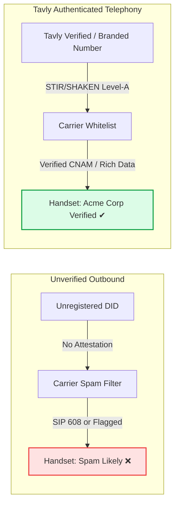

## What causes phone numbers to be labeled Spam Likely?

Major telecommunications carriers label phone numbers as **Spam Likely** when automated algorithmic scoring flags aggressive calling patterns, unverified caller identities, or frequent callee spam reports. This designation severely suppresses outbound call pickup rates, triggers immediate carrier call blocking, and risks telephony provider account suspension if left unaddressed.

Modern mobile operating systems and wireless service providers deploy centralized analytic engines (including First Orion, Hiya, and TNS) to evaluate inbound traffic. Unregistered numbers that place high-volume outbound campaigns without STIR/SHAKEN Level-A attestation are routinely classified as nuisance traffic.

<div className="flex flex-row gap-16">
  <Frame caption="Spam Likely call screen displaying negative carrier reputation warning.">
    
  </Frame>

  <Frame caption="Branded Call interface displaying verified corporate identity and trusted caller badge.">
    
  </Frame>
</div>

### Primary Triggers for Spam Designation

* **Unverified Caller ID**: Placing calls from phone numbers not anchored to a verified business registry or lacking CNAM registration.
* **Dialing Velocity Spikes**: Rapidly scaling call attempts without establishing warmup baselines across wireless carrier networks.
* **Low Call Duration Ratios**: High frequencies of calls answered and terminated in fewer than 15 seconds.
* **Direct Callee Complaints**: Handset users reporting numbers as spam through iOS or Android native reporting tools.

---

## How do you detect if your outbound numbers are flagged as Spam Likely?

To **detect if your outbound numbers are flagged as Spam Likely**, inspect your call logs for connection failures returning SIP error code 608, indicating carrier call rejection. You can also evaluate caller reputation by querying external carrier registry auditing databases such as Nomorobo and IPQualityScore.

Monitoring caller reputation requires combining automated platform error logs with independent telecommunication databases:

### 1. Monitor SIP Error Code 608 Rejections
When an outbound call terminates immediately without ringing, inspect the call record in your Tavly dashboard or webhook payload. 

* **SIP Code `608 Rejected`**: Officially defined by the IETF and FCC as a call rejected by an intermediate carrier machine learning algorithm because the calling number is categorized as unwanted or fraudulent.
* **Caveat**: Not all carrier spam blocks return SIP 608; some providers silently drop calls or redirect directly to voicemail (returning standard `486 Busy` or `487 Request Terminated` codes).

### 2. Query External Reputation Registries
Cross-reference your active caller IDs against industry phone intelligence platforms:

* **[Nomorobo](https://www.nomorobo.com/)**: Query phone numbers against consumer robocall blocking blacklists via API or console.
* **[IPQualityScore](https://www.ipqualityscore.com/phone-number-validator)**: Audit real-time fraud risk scores, carrier porting history, and active spam flags across North American networks.

---

## How do Tavly Verified Numbers and Branded Calling raise pickup rates?

**Tavly Verified Numbers and Branded Calling** restore caller reputation by registering verified enterprise identity directly into carrier databases. Verified numbers eliminate negative spam flags through STIR/SHAKEN cryptographic attestation, while Branded Calling displays your official business name and logo on mobile handsets, dramatically increasing call answer rates.

Tavly provides two enterprise telephony services to safeguard outbound reach:

| Capability | [Verified Phone Number](/deploy/calls/verified-phone) | [Branded Call (Rich Call Data)](/deploy/calls/branded-calls) |
| :--- | :--- | :--- |
| **Primary Mechanism** | Carrier database whitelist registration | Dynamic CNAM and mobile handset push display |
| **Handset Appearance** | Neutral standard phone number without spam warnings | Displays verified business name, logo, and call reason |
| **Spam Mitigation** | Guarantees STIR/SHAKEN Level-A attestation | Overrides carrier spam filters with authenticated identity |
| **Prerequisites** | Approved [Business Profile](/deploy/calls/business-profile) | Approved Business Profile and active phone line |
| **Best For** | Baseline outbound calling and transactional alerts | High-touch customer success, sales, and urgent notices |



### Setup and Lifecycle Operations

1. **Prerequisite**: Complete your verified [Business Profile](/deploy/calls/business-profile) with legal EIN registration.
2. **Rejection Management**: If an application is denied due to website mismatch or documentation errors, follow [How to Handle a Rejection](/deploy/calls/branded-call-rejection).
3. **Deprovisioning**: If a phone number is retired, see [Stop Caller ID Service](/deploy/calls/delete-service) to release carrier subscriptions.

---

## How do you optimize voice agents for iOS call screening?

To **optimize voice agents for iOS call screening**, update your agent system prompt with a dedicated screening response rule. When Apple Siri challenges an unknown caller to state their identity and purpose, the agent must deliver a concise, single-sentence response identifying their name and company before awaiting connection.

Modern Apple smartphones running iOS deploy an automated [Call Screening feature](https://support.apple.com/guide/iphone/screen-and-block-calls-iphe4b3f7823/ios). When an unfamiliar number calls, Siri answers immediately, transcribes the caller's response in real time, and displays it on the recipient's lock screen before ringing through.

<div className="flex flex-row gap-16">
  <Frame caption="iOS Call Screening lock screen prompting the caller to announce their name and reason for calling.">
    
  </Frame>
</div>

### System Prompt Adaptation

To ensure your voice agent navigates Siri screening successfully without terminating the session or confusing the transcription, add the following guidance to your agent instructions:

```text Agent prompt: iOS call screening wrap theme={"dark"}
## Automated call screening handling
If the call begins with an automated screening prompt (e.g., "Hi, if you record your name and reason for calling, I'll see if this person is available"):
- Deliver a concise, single-sentence identification: state your name, your company, and the exact purpose of the call.
- Do not ask follow-up questions or recite disclaimers.
- Immediately pause and wait silently for the callee to answer the forwarded call.

Example:
Q: "Hi, if you record your name and reason for calling, I'll see if this person is available."
A: "This is Alex from Tavly Care calling regarding your scheduled consultation tomorrow morning." <wait for response>
```

---

## Frequently Asked Questions

<AccordionGroup>
  <Accordion title="Does SIP error code 608 always mean my number is blocked everywhere?">
    No. SIP 608 indicates that the specific terminating carrier handling that particular call rejected the attempt based on its localized spam scoring. A number may connect normally on one carrier while facing blocks on another.
  </Accordion>

  <Accordion title="How long does it take for Verified Number registration to take effect?">
    Once your business profile is verified, carrier whitelist updates typically propagate across major telecom databases within 3 to 5 business days.
  </Accordion>

  <Accordion title="Can toll-free numbers be registered for Branded Calling?">
    Branded Calling is generally optimized for local 10DLC phone numbers. While toll-free numbers can maintain verified status, rich display data (such as logos and customized text reasons) is supported primarily on local lines.
  </Accordion>

  <Accordion title="What happens if an agent fails to answer the iOS call screen correctly?">
    If the agent remains silent, speaks an excessively lengthy greeting, or terminates the connection, Siri will dismiss the call without ever alerting the recipient, registering the attempt as an ignored missed call.
  </Accordion>
</AccordionGroup>

## Related Resources

* [Verified phone number guide](/deploy/calls/verified-phone): Step-by-step registration for STIR/SHAKEN Level-A carrier verification.
* [Branded calling deployment](/deploy/calls/branded-calls): Display enterprise names and logos on recipient handsets.
* [Telephony business profile setup](/deploy/calls/business-profile): Register legal business identities with telecom carriers.
* [Outbound call API](/deploy/outbound-calls): Place automated voice calls with custom metadata and error handling.
