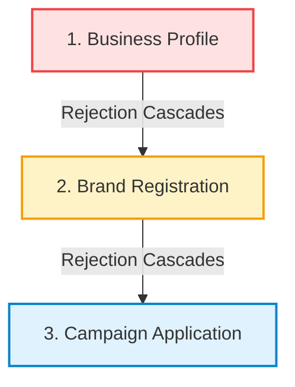

## What is the A2P 10DLC SMS campaign application and why is it required?

The **A2P 10DLC SMS campaign application** is a mandatory regulatory submission required by US cellular carriers to send commercial text messages from 10-digit local phone numbers. It verifies your organization's messaging use case, explicit customer opt-in consent mechanisms, privacy policies, and sample message templates to prevent carrier filtering and spam.

To send outbound SMS or conduct two-way text conversations from your own Tavly phone number, major telecommunications carriers (including AT&T, T-Mobile, and Verizon) mandate an approved A2P 10DLC (Application-to-Person 10-Digit Long Code) registration. Independent third-party reviewers evaluate your application holistically across four primary dimensions:

* **Use Case Classification**: Ensures your message intent matches carrier-defined categories.
* **Operational Description**: Confirms who sends messages, who receives them, and under what operational triggers.
* **Call-to-Action (Opt-In Flow)**: Proves that users gave prior express written or verbal consent before receiving messages.
* **Representative Sample Messages**: Validates message formatting, brand identification, and mandatory opt-out mechanisms.

<Note>
  This guide covers the campaign form submitted after your [Business Profile](/build/telephony/business-profile) and Brand Registration are configured. Submitting a campaign requires an active payment method on file in Tavly billing. For end-to-end telephony setup, see [Enable SMS](/deploy/enable-sms).
</Note>

---

## What are the campaign application form fields and carrier character limits?

The **campaign application form** requires six core data fields evaluated by carrier reviewers: application name, primary use case classification, a 40-to-1,000 character operational description, two representative sample messages between 20 and 200 characters each, an explicit end-user opt-in consent explanation up to 2,048 characters, and live website URLs for your Privacy Policy and Terms.

To access the registration form in the Tavly dashboard, open your phone number and navigate to **Advanced Add-Ons** > **SMS** > **Campaign Registration** > **Add Campaign Application**.

<Frame caption="The Add Campaign Application form, with the business profile and brand steps completed behind it.">
  
</Frame>

### Field Validation and Limits

| Field Name | Character / Input Limits | Regulatory Compliance Notes |
| :--- | :--- | :--- |
| **Application Name** | Any text | Internal administrative label. Not submitted to carrier reviewers. |
| **Use Case** | Single select dropdown | Fixed upon submission. Must match description, samples, and consent flow. |
| **Description for the use of SMS** | 40 to 1,000 characters | Short or generic text is automatically rejected. Aim for 300 to 700 characters. |
| **Sample Message (Box 1 & 2)** | 20 to 200 characters each | Both required. Must state the business name and include STOP opt-out phrasing. |
| **How do end-users consent to receive messages?** | 40 to 2,048 characters | Known as the Message Flow / Call-to-Action (CTA). The most scrutinized field. |
| **Privacy Policy URL** | Complete `https://` URL | Must reside on your verified brand domain with mobile disclosure clause. |
| **Terms and Conditions URL** | Complete `https://` URL | Must reside on your verified brand domain with messaging terms. |

### Automated Platform Defaults

Tavly applies default configurations to optimize carrier deliverability:

1. **Embedded Links and Phone Numbers**: Campaigns are registered with both **"messages contain links"** and **"messages contain phone numbers"** enabled. Hyperlinks must point to your verified domain; public URL shorteners (such as bit.ly, tinyurl, or goo.gl) result in immediate rejection.
2. **Standard Carrier Opt-Out Handlers**: Upstream carrier automation handles `STOP`, `UNSUBSCRIBE`, `CANCEL`, `END`, `QUIT`, and `HELP` responses on Tavly numbers. You do not need to configure custom keyword responders, but your samples and consent disclosures must explicitly state that recipients can reply STOP.

---

## How do you complete each step of the SMS campaign application?

To **complete the SMS campaign application**, choose an accurate use case category, draft a detailed three-to-six sentence description identifying sender and recipients, document verbal or web consent workflows with mandatory carrier disclosures, supply compliant privacy links, formulate two compliant sample messages, and submit the application for upstream carrier review.

Follow this field-by-field procedure to ensure compliance with carrier review standards:

<Steps>
  <Step title="Select an accurate use case category">
    Select the category that precisely matches your operational traffic. If sending multiple message types, choose **Mixed**. For small deployments, select **Low Volume Mixed** (supports up to 2,000 message segments per day across all carriers). The campaign registration fee remains identical across all use cases.

    | Use Case | Permitted Traffic Description | Typical Tavly AI Voice Agent Scenario |
    | :--- | :--- | :--- |
    | **Customer Care** | Support interactions, account inquiries, call summaries | Post-call summaries, dispatching quotes or links discussed on calls |
    | **Account Notification** | Account-status notices only (balance alerts, billing updates) | **Not appointment reminders.** Reminders filed here are rejected by carriers |
    | **Delivery Notification** | Real-time shipping, technician dispatch, or delivery ETA | Field service dispatch notifications, order ready for pickup |
    | **Marketing** | Promotional campaigns, discount offers, announcements | Sales follow-ups offering promotional pricing or special discounts |
    | **Mixed** | Any combination of customer care, notices, and reminders | Appointment reminders, scheduling notices, and support from one number |
    | **Low Volume Mixed** | Any combination with low daily volume (up to 2,000 msgs/day) | Recommended for small businesses, pilots, and low-volume appointments |
    | **2FA** | One-time security passcodes and identity verification | Authenticating a phone caller's identity via SMS code during a call |
    | **Security / Fraud Alert** | Suspicious login alerts, unauthorized transaction alerts | Immediate fraud alerts following security-triggered voice interactions |
    | **Higher Education** | Academic notifications, admissions, and campus operations | College admissions scheduling, financial aid office call follow-ups |
    | **Polling and Voting** | Non-political satisfaction surveys and post-call feedback | Post-call customer satisfaction (CSAT) text surveys |
    | **Public Service** | Urgent civil advisories, public utility alerts, community notices | Rare public advisory voice-to-SMS announcements |

    <Warning>
      **Prohibited Use Cases Across All Tiers (SHAFT-C and High-Risk Categories):**
      
      * **Debt Collection**: Any payment collection reminders resembling debt collection.
      * **Prohibited Content**: Sex, hate speech, alcohol, firearms, tobacco, or cannabis (vaping/CBD).
      * **High-Risk Financial Services**: Payday loans, peer-to-peer lending, credit repair, cryptocurrency, or debt relief.
      * **Third-Party Lead Generation**: Marketing on behalf of third parties or sharing consent lists.
      * **Multi-Brand Aggregation**: Registering multiple distinct business brands under a single campaign.
    </Warning>
  </Step>

  <Step title="Write a detailed campaign description">
    Carrier reviewers must understand **who** is sending the messages, **who** receives them, **what** informational topics are covered, and **how** consent was acquired. Draft three to six clear, formal sentences.

    ```text Template wrap theme={"dark"}
    [Business Name] ([Legal Name] doing business as [Website Name], if different) uses this campaign to send [message type 1], [message type 2] and [message type 3] to [existing customers / prospective customers who requested a call / patients with a booked appointment]. Recipients opt in [verbally during a phone call with our automated AI phone assistant / by submitting a form on our website at https://www.yourdomain.com/page / both]. Messages are [transactional and informational only / promotional / a mix of transactional and promotional] and are sent [after a call / before an appointment / when an order status changes]. Every message identifies [Business Name] and includes opt-out instructions (reply STOP).
    ```

    #### Sample Description: Customer Care
    > Acme Home Services uses this campaign to send two-way customer support messages, follow-ups to phone conversations, requested quotes and service information to existing customers and prospective customers who contact us by phone or request a call on our website at https://www.acmehomeservices.com/contact. Recipients opt in verbally during a call with our automated AI phone assistant, or by submitting our website contact form. Messages are transactional and informational only, sent after a call or when a customer requests information. Every message identifies Acme Home Services and includes opt-out instructions (reply STOP).

    #### Sample Description: Low Volume Mixed (Appointment Reminders)
    > Bright Smile Dental uses this campaign to send appointment confirmations, appointment reminders, reschedule notices and post-visit follow-ups to patients who have booked an appointment with our office. Patients opt in verbally when they book by phone with our automated scheduling assistant, or by checking the SMS consent box on our online booking form at https://www.brightsmiledental.com/book. Messages are informational only and are sent when an appointment is booked, 24 hours before the appointment, and after the visit. Every message identifies Bright Smile Dental and includes opt-out instructions (reply STOP).

    <Tip>
      Refer to your agent as an "automated AI phone assistant" directly. Carrier review teams recognize and accept this terminology; omitting it can appear evasive.
    </Tip>
  </Step>

  <Step title="Document end-user consent mechanisms (Message Flow)">
    Describe precisely **where** users encounter the opt-in mechanism, the **specific affirmative action** taken, and all mandatory legal disclosures. If consent is collected by voice, include the exact script spoken by the AI assistant.

    **Nine Mandatory Regulatory Disclosures:**
    1. Registered business name.
    2. Specific categories of SMS content to be sent.
    3. Mandatory disclosure: *"Message and data rates may apply."*
    4. Frequency disclosure: *"Message frequency varies"* or explicit cadence (e.g., *"up to 4 msgs/month"*).
    5. Opt-out and assistance keywords: *"Reply STOP to unsubscribe, HELP for help."*
    6. Exact URL of the online form or verbatim transcript of the verbal voice script.
    7. Clear affirmative confirmation: customer's verbal "Yes" or checked web box.
    8. Direct links to both your Privacy Policy and Terms of Service.
    9. Web form standard: Checkbox must be optional, unchecked by default, and never a condition of purchase.

    #### Option A: Verbal Opt-In Flow During an AI Voice Call
    ```text Verbal opt-in flow wrap theme={"dark"}
    End users opt in verbally during a phone call with [Business Name]'s automated AI phone assistant. Customers call [Business Name] at [your published business number] for [support / scheduling / quotes]. Before the call ends, the assistant reads the following script:

    Assistant: "Before we finish up, would it be alright if [Business Name] sends you text messages regarding [your appointment / a summary of this call / the information you requested]? Message and data rates may apply. Message frequency varies. You can opt out at any time by replying STOP, or reply HELP for help. Our Terms of Service are at https://www.[yourdomain].com/terms and our Privacy Policy is at https://www.[yourdomain].com/privacy. Do I have your permission to send you these texts? Please say yes or no."

    Customer: "Yes."

    Assistant: "Great, you're opted in. You'll receive a confirmation text shortly. Reply STOP at any time to unsubscribe."

    Only after an explicit "yes" does the assistant record consent and trigger the first message, an automated confirmation text:
    "[Business Name]: You're opted in to receive [content type] texts. Msg & data rates may apply. Msg frequency varies. Reply STOP to cancel, HELP for help. https://www.[yourdomain].com/privacy"

    If the customer says no or does not answer, no text messages are sent.
    ```

    *Note on Outbound Voice*: Replace the initial context with: *"[Business Name]'s assistant calls customers who requested a callback or booked an appointment at the number they provided."*

    #### Option B: Website Form Opt-In with Checkbox
    ```text Web form opt-in flow wrap theme={"dark"}
    End users opt in by visiting our website at https://www.[yourdomain].com/[page]. On the form, users enter their phone number and are presented with an optional, unchecked checkbox that reads:

    "I agree to receive [transactional / promotional] SMS messages from [Business Name] regarding [content type]. Message and data rates may apply. Message frequency varies. Reply STOP to unsubscribe or HELP for help. View our Privacy Policy at https://www.[yourdomain].com/privacy and Terms at https://www.[yourdomain].com/terms."

    Checking the box is optional and is not a condition of purchase; the form can be submitted with the box unchecked. When the form is submitted with the box checked, an automated confirmation text is sent to verify the opt-in:
    "[Business Name]: You're opted in to receive [content type] texts. Msg & data rates may apply. Msg frequency varies. Reply STOP to cancel, HELP for help. https://www.[yourdomain].com/privacy"
    ```

    <Warning>
      Reviewers manually inspect submitted web forms. The SMS consent checkbox must never be pre-checked, must not be grouped with email newsletter signups, and must be separate from the Terms agreement.
    </Warning>
  </Step>

  <Step title="Supply Privacy Policy and Terms of Service URLs">
    Both URLs must be live, use secure `https://`, reside on your verified organizational domain, and be pasted into the respective URL input boxes as well as within the message flow text.

    Your public Privacy Policy must include a dedicated clause stating that SMS consent is never shared with third parties. Insert this clause under your third-party sharing section:

    ```text Privacy Policy clause wrap theme={"dark"}
    No mobile information will be shared with third parties or affiliates for marketing or promotional purposes. All the above categories exclude text messaging originator opt-in data and consent; this information will not be shared with any third parties.
    ```

    <Warning>
      Reviewers must be able to view this clause without navigating complex accordion menus or tabbed interfaces. Anchor links that fail to display the text immediately cause rejections with the error *"unable to locate the privacy policy details inside this provided link"*.
    </Warning>
  </Step>

  <Step title="Draft two compliant sample messages">
    Submit two representative messages between 20 and 200 characters each. Every sample must:

    * Explicitly identify your business name (`[Business Name]`).
    * Include clear opt-out language (e.g., *"Reply STOP to opt out"*).
    * Enclose dynamic variables in brackets (`[Date]`, `[Time]`, `[Amount]`).
    * Use only links hosted on your verified primary domain.
    * Maintain consistency with your selected use case.

    ```text Opt-In Confirmation (Applicable to Any Use Case) wrap theme={"dark"}
    [Business Name]: You're opted in to receive [appointment reminders / call follow-ups] by text. Msg & data rates may apply. Msg frequency varies. Reply STOP to cancel, HELP for help.
    ```

    ```text Post-Call Follow-Up (Customer Care, Mixed) wrap theme={"dark"}
    [Business Name]: Thanks for calling today. As discussed, your quote is $[Amount]. Details: https://www.[yourdomain].com/quote/[ID]. Questions? Call [Phone]. Reply STOP to opt out.
    ```

    ```text Appointment Reminder (Mixed, Low Volume Mixed) wrap theme={"dark"}
    Reminder from [Business Name]: you have an appointment tomorrow, [Date] at [Time], at [Address]. Need to reschedule? Call [Phone]. Reply STOP to opt out.
    ```

    ```text Technician ETA Alert (Delivery Notification) wrap theme={"dark"}
    [Business Name]: Your technician [Name] is on the way and should arrive between [Start] and [End]. Track: https://www.[yourdomain].com/track/[ID]. Reply STOP to opt out.
    ```

    ```text Promotional Announcement (Marketing, Mixed) wrap theme={"dark"}
    [Business Name]: Members get [Offer] on [Service] through [Date]. Book at https://www.[yourdomain].com/book. Msg frequency varies. Msg & data rates may apply. Reply STOP to opt out.
    ```
  </Step>

  <Step title="Save and submit for carrier review">
    Click **Save**. The button activates once all required fields satisfy length and format validations. In the SMS panel, select the newly created campaign and click **Next** to submit.

    Submitting a campaign incurs a **\$15 one-time carrier review fee**, charged regardless of approval outcome. Once the brand is approved, upstream carrier review typically takes 3 to 4 business days. Tavly sends an email notification upon approval or rejection.
  </Step>
</Steps>

---

## How do you configure voice agents to collect verbal SMS opt-in consent?

To **configure voice agents to collect verbal SMS opt-in consent**, inject a verbatim script directly into your agent prompt requiring explicit verbal agreement before sending text messages. The prompt must instruct the agent to state message frequency, rate disclosures, opt-out keywords, and privacy links before dispatching an initial confirmation text.

Because your regulatory filing promises an exact conversational consent workflow, your deployed AI agent must strictly follow the submitted script. Add the following instruction block to your agent's system prompt:

```text Agent prompt: SMS consent wrap theme={"dark"}
## SMS consent instructions
You may only send a text message after the caller explicitly agrees to receive texts. Before sending any SMS, say this, word for word:

"[Paste the verbatim consent script from your campaign application here.]"

- If the caller clearly says yes: say "Great, you're opted in. You'll receive a confirmation text shortly. Reply STOP at any time to unsubscribe." Then send the SMS.
- If the caller says no, is unsure, or does not answer: say "No problem, we won't send you any texts." Do not send any SMS, and do not ask again on this call.
- Never send a text to a number the caller did not confirm is their mobile number.
```

### Operational Compliance Rules

* **Dispatch Opt-In Confirmation First**: The initial message sent to a customer must be the registered confirmation template.
* **Identify Brand in Every SMS**: Every message sent by your agent or system must contain your business name.
* **Mandatory Opt-Out**: Ensure every text concludes with *"Reply STOP to opt out"*. If actual messaging deviates from registered samples, carriers may suspend phone numbers or telephony subaccounts.

---

## How do you resolve and resubmit a rejected A2P campaign application?

To **resolve and resubmit a rejected A2P campaign application**, review the specific rejection reason provided in your Tavly console, resolve upstream profile or brand discrepancies first, click Edit to update campaign fields in place, and resubmit for review without incurring an additional fifteen-dollar registration fee under the same use case.

When an application is rejected, Tavly displays the carrier rejection reason directly in the console and dispatches an automated notification:

<Frame caption="Reopening a rejected campaign. The reason sits at the top and every field stays editable except Use Case.">
  
</Frame>

### Resubmission Fee Rules

* **In-Place Corrections**: Correcting fields under the same use case is **free of charge**.
* **Use Case Modifications**: Because carrier registries lock the **Use Case** field upon registration, changing a use case requires clicking **Add Campaign Application** to register a new campaign, incurring a new **\$15 carrier fee**.

### Hierarchical Rejection Resolution

Rejections cascade downward from the top of the telephony profile hierarchy:



1. **Business Profile**: If the business profile is rejected, the brand and campaign are automatically rejected with the profile's error message. Resolve profile discrepancies first under [Telephony Business Profile](/build/telephony/business-profile).
2. **Brand Registration**: Update company information under **Brand Registration**. Re-submitting an existing brand type is free. Campaign controls remain locked until the brand returns to pending or approved status.
3. **Campaign Application**: Once the brand is approved, click **Edit** on the rejected campaign, address the reviewer feedback, and click **Next** to resubmit.

### Common Reviewer Feedback and Remediation Matrix

| Carrier Reviewer Feedback | Root Cause | Remediation Procedure |
| :--- | :--- | :--- |
| **"Brand/Website mismatch: unable to validate connection..."** | Legal entity name differs from public website branding. | Add `"[Legal Name] doing business as (DBA) [Website Name]"` to the description and consent text. |
| **"CTA: unable to validate the opt-in process..."** | Consent flow was described vaguely without explicit proof. | Provide the direct URL to the opt-in form, or paste the complete verbal script with customer affirmative responses. |
| **"Unable to locate the privacy policy details inside this provided link"** | The mobile sharing restriction clause is hidden or missing. | Ensure the non-sharing mobile clause is immediately visible on the target URL without clicking tabs or modals. |
| **"Appointment reminders not allowed under Account Notification"** | Incompatible use case selected. | Register a new campaign under **Mixed** or **Low Volume Mixed** (\$15 fee). The use case cannot be edited in place. |
| **"Please include in Message Flow links to privacy policy & terms"** | URLs were supplied in form inputs but omitted from flow text. | Paste the full `https://` URLs for Privacy Policy and Terms directly into the consent text box. |
| **"Description too short, vague, or generic"** | Description lacked operational specifics. | Expand description to 300–700 characters naming sender, recipient pool, message triggers, and STOP opt-out terms. |
| **"Opt-in page has pre-checked box or requires consent"** | Web form violates carrier opt-in standards. | Configure the checkbox to be unchecked by default and optional for form submission. |
| **"Public URL shortener in a sample"** | Sample message contained a shortened link (e.g., bit.ly). | Replace third-party shorteners with branded links residing on your verified domain. |

---

## Frequently Asked Questions

<AccordionGroup>
  <Accordion title="Do I need brand approval before submitting an SMS campaign?">
    No. You can draft and submit the campaign application as soon as the brand registration is in pending review. Tavly queues the campaign and automatically transmits it to upstream carriers once brand approval completes.
  </Accordion>

  <Accordion title="Does resubmitting a rejected campaign cost another $15?">
    No. In-place corrections under the same use case are reviewed at no additional cost. The \$15 fee is charged only when registering an entirely new campaign record due to a use case change or brand type update.
  </Accordion>

  <Accordion title="My brand was rejected alongside my campaign. What should I fix first?">
    Address the business profile first, followed by the brand, and lastly the campaign. Because a rejection cascades downward, an error at the profile level automatically marks downstream brands and campaigns as rejected.
  </Accordion>

  <Accordion title="Can I edit an approved or pending SMS campaign?">
    No. Once a campaign is pending review or approved, it is locked against edits by carrier registries. To modify messaging parameters on an approved number, remove the SMS add-on and submit a new campaign.
  </Accordion>
</AccordionGroup>

## Related Resources

* [Enable SMS on Tavly numbers](/deploy/enable-sms): Configure telephony add-ons, pricing, and two-way chat agent routing.
* [Telephony business profile setup](/build/telephony/business-profile): Register legal business identities with upstream carrier registries.
* [Inbound webhook integration](/deploy/inbound-call-webhook): Process incoming SMS events and inject custom caller context dynamically.
* [Create conversational chat agents](/build/create-chat-agent): Build autonomous text agents to manage bidirectional SMS conversations.
