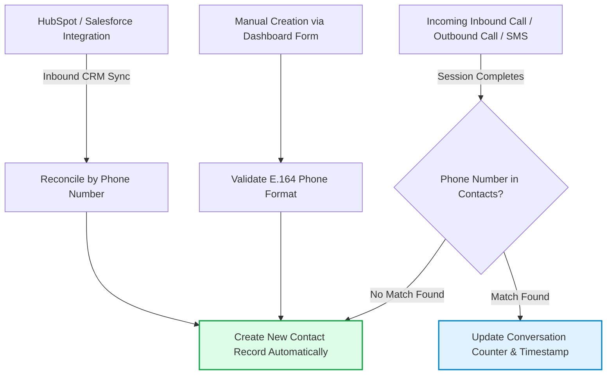

## What is the Tavly Contacts system and how does cross-session memory work?

The **Tavly Contacts system** is a persistent customer relationship database keyed by phone number that stores unified interaction histories and custom attributes. By caching customer data and conversation outcomes, the system automatically injects historical context as dynamic variables into future phone calls, eliminating redundant customer discovery across multi-call journeys.

Located under **Data** > **Contacts** in the dashboard, this central repository maintains an ongoing record of every customer who communicates with your voice agents:

<Frame caption="The Contacts page, showing each contact's conversation count and last conversation.">
  <div style={{ aspectRatio: '16 / 9', display: 'flex', alignItems: 'center', justifyContent: 'center', width: '100%' }}>
    
  </div>
</Frame>

### Key Business Applications

* **Single Source of Truth**: Two-way synchronization with [external CRMs](/integrations/crm-overview) (such as HubSpot or Salesforce) eliminates repetitive manual parameter passing during API-triggered calls.
* **Resilient Multi-Call Continuity**: When a voice session disconnects unexpectedly or a caller dials back, the agent greets them with full situational awareness.
* **Automated Follow-Up Sequences**: Outbound agents read data generated by previous calls to negotiate pricing, confirm appointments, or resolve escalations.
* **Workspace-Wide Data Schema**: Contact field definitions and post-call mapping rules apply globally across all agents in your workspace.

---

## How are contact records created and synchronized with external CRMs?

Contact records are **created through three primary channels**: automatically upon termination of an unrecognized phone call or SMS thread, manually via dashboard forms, or dynamically synchronized through two-way CRM integrations with platforms like HubSpot and Salesforce, which continuously reconcile customer attributes and do-not-call compliance flags.

### Creation Ingestion Channels



1. **Automatic Conversation Capture**: Whenever an inbound call, outbound phone call, or cellular SMS chat completes, Tavly checks if the participant's phone number exists. If no match is found, a new record is created automatically.
2. **Manual Addition**: Administrators can click **Actions → Add contact** to create records directly in the console.
3. **Enterprise CRM Synchronization**: Connecting a supported CRM allows customer records and custom properties to ingest automatically via scheduled or on-demand sync.

<Note>
  **Telephony Identifier Constraint**: A phone number represents a strictly unique entity key. Attempting to add or import a duplicate number triggers a validation error (`A contact with phone number +14155551000 already exists`). Browser-based web calls and web chats carry no phone numbers and do not create contact records.
</Note>

<Frame caption="Everything on the Contacts page that changes data lives in the Actions menu.">
  <div style={{ aspectRatio: '16 / 9', display: 'flex', alignItems: 'center', justifyContent: 'center', width: '100%' }}>
    
  </div>
</Frame>

### Step-by-Step Manual Contact Creation

<Steps>
  <Step title="Open the creation form">
    Select **Actions → Add contact** in the upper-right corner of the Contacts tab.

    <Frame caption="The Add Contact form, with the workspace's custom fields below the built-in ones.">
      
    </Frame>
  </Step>

  <Step title="Input mandatory E.164 phone number">
    Enter a valid phone number formatted in standard international E.164 notation (e.g., `+14155552671`).
  </Step>

  <Step title="Assign standard and custom attributes">
    Input optional values including **First Name**, **Last Name**, and **Do Not Call** status, alongside workspace custom fields. Inputs are validated strictly against their defined schema type.
  </Step>

  <Step title="Save and persist">
    Click **Create**. The record immediately appears in the directory and is ready to ingest future conversation events.
  </Step>
</Steps>

---

## How do you define custom contact fields and post-call data mappings?

To **define custom contact fields and post-call data mappings**, navigate to Actions and select Manage contact fields to register typed attributes such as Text, Number, Selector, or Date. Configure post-call extraction rules with Overwrite, Fill only if empty, or Accumulate and summarize update policies to aggregate ongoing relationship context.

Opening **Actions → Manage contact fields** displays your workspace field directory:

<Frame caption="Contact fields, with CRM sync and post-call mappings shown per field.">
  <div style={{ aspectRatio: '16 / 9', display: 'flex', alignItems: 'center', justifyContent: 'center', width: '100%' }}>
    
  </div>
</Frame>

### Field Creation Workflow

<Steps>
  <Step title="Define field identity and data type">
    Click **Add Contact Field** and specify an attribute type: `Text`, `Number`, `Boolean`, `Selector` (enum), `Date`, or `Datetime`. Data types are permanent and cannot be modified after creation.

    <Frame caption="Adding a contact field. The type can't be changed once the field exists.">
      
    </Frame>
  </Step>

  <Step title="Assign snake_case naming">
    Provide a unique identifier using lowercase alphanumeric characters and underscores (e.g., `account_tier`). System prefixes `contact` and `external` are reserved.
  </Step>

  <Step title="Document extraction instructions">
    Enter a precise field description. Beyond human readability, this description serves as the exact instruction given to the LLM when utilizing the **Accumulate & summarize** update mode.
  </Step>

  <Step title="Configure post-call update policy">
    Toggle **Map with Post-Call Data** to bind an extracted variable from [Post Call Analysis](monitor/post-call-analysis-overview) to this contact attribute.
  </Step>
</Steps>

### Post-Call Extraction Update Policies

| Update Policy | Operational Mechanics | Best For |
| :--- | :--- | :--- |
| **Overwrite** | Replaces the existing stored value with new extracted data after every call. | Volatile metrics like `last_sentiment` or `latest_callback_time`. |
| **Fill only if empty** | Writes the value during the first call and leaves it unmodified thereafter. | Permanent attributes like `acquisition_source` or `onboarding_date`. |
| **Accumulate & summarize** | Uses an LLM to merge historical context with new call findings into a coherent summary. | Longitudinal context like `customer_objections` or `case_notes`. |

---

## How do voice agents utilize contact data during live phone calls?

During live phone calls, Tavly AI performs an instantaneous lookup matching the customer's E.164 phone number and **injects all stored contact fields as dynamic variables** into the agent's prompt. Voice agents reference these variables using double curly braces to greet returning callers by name and reference previous agreements.

When an inbound call arrives or an outbound dial connects:

1. **Carrier Lookup**: The telephony layer reads the remote E.164 phone number.
2. **Database Binding**: Tavly fetches the matching contact profile.
3. **Prompt Interpolation**: All built-in (`first_name`, `last_name`, `do_not_call`) and custom attributes are passed to the agent runtime as [dynamic variables](/build/context/dynamic-variables).

```text System prompt example wrap theme={"dark"}
## Greeting instructions
You are speaking with {{first_name}} {{last_name}}.
- Company: {{company_name}}
- Account Tier: {{account_tier}}
- Previous Context: {{situation_summary}}

If {{first_name}} is populated, greet them warmly: "Hi {{first_name}}, thanks for calling back. Are you still interested in discussing our {{account_tier}} plans?"
If {{first_name}} is absent, provide your default professional opening.
```

<Frame caption="A contact's fields on the left, every call and chat with that number on the right.">
  
</Frame>

---

## How do you execute historical backfills and manage contact permissions?

To **execute historical backfills and manage contact permissions**, select Backfill from Post-Call Data in the Actions menu to populate newly mapped fields from historical transcripts. Access to view or modify contact records is strictly governed by workspace role-based access controls requiring dedicated CRM permissions for write operations.

### Running Historical Data Backfills

When you introduce new custom contact fields or adjust post-call extraction schemas, existing historical records remain unpopulated until backfilled:

<Frame caption="Backfilling contact fields from conversations that already happened.">
  
</Frame>

* **Execution Scope**: Navigate to **Actions → Backfill from Post-Call Data**, select the target fields, and define the historical date range and agent scope.
* **Concurrency Limits**: Only one backfill operation can run concurrently per workspace.
* **Extraction Prerequisites**: Backfills require at least one active post-call mapping rule to execute.

### Role-Based Access Controls

* **CRM View Permission**: Required to browse contacts, filter directory tables, and inspect conversation logs.
* **CRM Edit Permission**: Required to create contacts, edit field values, run historical backfills, and trigger full CRM synchronizations. See [Access Control](/accounts/access-control).

<Note>
  Contacts are currently managed through the Tavly dashboard and native CRM connectors. There is no standalone public REST API endpoint for managing contacts directly.
</Note>

---

## Frequently Asked Questions

<AccordionGroup>
  <Accordion title="Can I bulk import contacts using a CSV spreadsheet?">
    Direct CSV contact uploads are not supported currently. Contacts must be imported via native [CRM integrations](/integrations/crm-overview), created manually in the console, or captured automatically when conversations complete.
  </Accordion>

  <Accordion title="Why do contacts appear in my directory that were never manually added?">
    Whenever an inbound or outbound phone call terminates with a previously unrecognized phone number, Tavly automatically creates a contact record to anchor transcripts and cross-call memory.
  </Accordion>

  <Accordion title="Why are contact variables missing from browser web calls?">
    Web calls and web chat widgets operate over WebRTC and WebSockets without an underlying E.164 telephone number. Consequently, they do not bind to contact records or receive automated contact dynamic variables.
  </Accordion>

  <Accordion title="What occurs if I disconnect my integrated CRM?">
    All imported contacts, custom fields, and conversation histories remain securely preserved in your Tavly workspace. Real-time field synchronization stops, and external IDs are retained for reference.
  </Accordion>

  <Accordion title="Can contact records be permanently deleted?">
    To prevent data loss and preserve audit history, contacts cannot be deleted directly from the console. However, custom field values can be cleared manually, and contacts synced from CRMs remain protected while two-way sync is active.
  </Accordion>
</AccordionGroup>

## Related Resources

* [Dynamic variables guide](/build/context/dynamic-variables): Format custom placeholders for prompt injection and CRM tool bindings.
* [Post-call analysis overview](monitor/post-call-analysis-overview): Extract structured data variables from audio transcripts.
* [CRM integrations overview](/integrations/crm-overview): Connect HubSpot, Salesforce, and custom CRMs for two-way sync.
* [Building persistent contact memory](/integrations/build-contact-memory): Maintain cross-session memory and context across long-term relationships.
