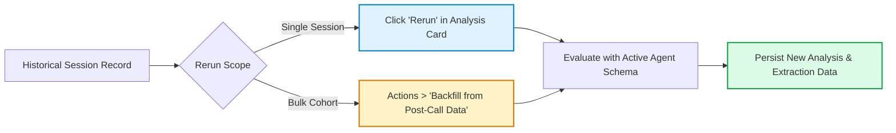

## What is call and chat session history and when should you use it?

**Call and chat session history** provides a comprehensive post-session observability dashboard for all voice and text interactions in Tavly AI. It enables engineering, product, and compliance teams to audit audio recordings, review synchronized transcripts, analyze LLM extraction outcomes, investigate disconnection reasons, and export structured operational datasets for business intelligence.

Located under **Data** in the Tavly dashboard, the **Call History** and **Chat History** pages aggregate real-time conversation records the moment a session terminates. For calls currently in progress, utilize [Live Monitoring](/features/live-monitoring) instead.

### Primary Operational Use Cases

* **Disconnect Diagnosis**: Isolate dropped or unsuccessful calls by analyzing carrier disconnection reasons and SIP codes.
* **Conversational Auditing**: Listen to stereo audio recordings, review turn-by-turn transcripts, and examine tool call inputs/outputs.
* **A/B Performance Benchmarking**: Compare conversion outcomes and latency figures across different agent versions.
* **Targeted Cohort Extraction**: Filter sessions by dynamic CRM variables, user sentiment scores, or custom analysis fields.
* **Compliance Archival**: Generate PII-scrubbed CSV data exports for external data warehousing and regulatory audits.

---

## How do you browse, filter, and customize session logs?

To **browse, filter, and customize session logs**, open Call History or Chat History under Data in the dashboard, apply date range boundaries, and filter across attributes like agent version, disconnection reason, or metadata. Click Customize View to configure visible columns and share your filtered URL directly with team members.

Both pages provide a unified tabular view of interactions:

<Frame caption="Call History controls and session table.">
  
</Frame>

### Supported Filter Dimensions

| Filter Parameter | Call History Scope | Chat History Scope | Operational Application |
| :--- | :--- | :--- | :--- |
| **Identity & Version** | Agent ID, Agent Version, Session ID, Batch Call ID | Agent ID, Agent Version, Session ID | Audit specific release candidate deployments |
| **Telephony Specs** | Phone Number, Direction, Channel Type, Duration | N/A | Compare inbound vs. outbound campaign performance |
| **Session Lifecycle** | Status (`registered`, `not_connected`, `ended`) | Status (`ongoing`, `ended`, `error`) | Identify dialing bottlenecks and timeout drops |
| **Quality & Latency** | End-to-End Latency, Disconnection Reason | Disconnection Reason | Track telecom performance and audio delivery delays |
| **Semantic Intelligence** | Outcome, Sentiment, Custom Analysis Fields | Outcome, Sentiment, Custom Analysis Fields | Isolate negative user interactions or failed intents |
| **Contextual Data** | Dynamic Variables, Custom Metadata | Custom Metadata | Filter by customer ID, order number, or CRM tags |

<Frame caption="Chat History with session filters and view controls.">
  
</Frame>

### View Customization and Navigation

* **Shareable URL Filtering**: Active filter parameters are automatically encoded into the dashboard URL, allowing team members to share exact session views instantly.
* **Table Pagination**: Adjust page sizes between 10, 20, 50 (default), or 100 records per view.
* **AI Conductor Deep Dives**: Check multiple rows and click **Conductor** to pass the selected conversation transcripts directly into the [AI Conductor Assistant](/conductor/overview#select-calls-and-chats-from-history) for cross-session synthesis.

---

## How do you inspect session transcripts, recordings, and diagnostic logs?

To **inspect session transcripts, recordings, and diagnostic logs**, select any session row to launch the comprehensive inspection drawer. You can listen to synchronized stereo recordings, audit tool execution payloads, trace conversation flow state transitions, examine extracted dynamic variables, and inspect raw SIP network packet captures for telephony troubleshooting.

Selecting a session opens an in-depth audit drawer with multi-tab navigation:

<Frame caption="Call details with analysis and transcript tabs.">
  
</Frame>

### Diagnostic Inspection Tabs

* **Conversation Analysis**: Displays post-session extraction outcomes, user sentiment ratings, explicit disconnection codes, and custom evaluation metrics.
* **Audio Recording Playback**: Interactive media player with timestamp-scrubbing. Clicking any transcript turn automatically seeks the audio player to that exact millisecond.
* **Transcription**: Complete turn-by-turn dialogue, including agent utterances, caller replies, tool calling parameters, knowledge base vector matches, and [conversation flow node transitions](/build/conversation-flow/overview).
* **Data Variables**: Audit initial dynamic variables passed at call inception, variables overridden in-flight, and variables extracted post-session.
* **Contact Memory**: View historical conversation timeline and persistent user memory profiles via [Contact Memory](/integrations/build-contact-memory).
* **Detail Logs & Packet Capture**: In-depth trace of LLM prompt calls, speech recognition timing, and raw SIP network PCAP files for [SIP connection debugging](/reliability/debug-calls-pcap).

<Frame caption="Chat details with analysis, summary, transcript, and contact history.">
  
</Frame>

---

## How do you rerun post-session analysis and execute bulk backfills?

To **rerun post-session analysis and execute bulk backfills**, click Rerun inside the Conversation Analysis card for an individual session, or select Backfill from Post-Call Data under the Actions menu for filtered datasets. The extraction engine re-evaluates conversations against updated agent prompts without re-triggering telephony webhooks.

When prompt engineers refine extraction schemas or post-call evaluation logic, existing historical sessions can be reprocessed without placing new calls:

### Operational Rules

* **Billing Considerations**: Rerunning analysis incurs standard LLM token extraction costs.
* **Webhook Isolation**: Rerunning analysis updates dashboard data and API records but deliberately suppresses outgoing webhook re-fires to prevent double-counting in downstream CRMs.
* **Programmatic Execution**: Rerun analysis at scale using the [Rerun Call Analysis API](/api-references/rerun-call-analysis) or [Rerun Chat Analysis API](/api-references/rerun-chat-analysis).

---

## How do you export filtered session data and enforce PII privacy controls?

To **export filtered session data and enforce PII privacy controls**, apply targeted filters, select Export from the Actions menu, and specify desired columns. To protect sensitive customer information, toggle PII scrubbing, restrict unmasked data access via role-based permissions, or permanently purge recorded artifacts using the granular delete options.

### Exporting Filtered Records

<Steps>
  <Step title="Configure export schema">
    Apply required filters, click **Actions**, and select **Export**. Select standard metrics or include export-only columns such as full raw transcripts, scrubbed dialogue, and public recording audio URLs.
  </Step>

  <Step title="Background generation">
    Tavly AI generates the CSV asynchronously. Large cohorts are batched in the cloud without impacting console responsiveness.
  </Step>

  <Step title="Download completed records">
    Navigate to **Actions → Export records** to monitor progress and download the finalized CSV file. Export archives remain downloadable for **one week**.
  </Step>
</Steps>

### Privacy and Data Scrubbing Controls

* **PII Redaction Toggling**: When [PII scrubbing](/accounts/privacy-disable) is active, credit card numbers, phone numbers, and addresses are masked in transcripts. Authorized personnel can click **Show PII** to reveal raw values.
* **Permanent Data Purging**: Administrators can open the trash menu on individual sessions to execute:
  * **Remove Sensitive Data**: Deletes audio recordings and transcripts permanently while retaining high-level duration and cost metadata.
  * **Delete Call**: Completely purges the entire call record from Tavly servers.
* **Programmatic Chat Purging**: Use the [Delete Chat API](/api-references/delete-chat) to remove chat sessions programmatically.

<Warning>
  Executing "Remove Sensitive Data" or "Delete Call" permanently destroys underlying audio files and transcripts. This action is irreversible.
</Warning>

---

## Frequently Asked Questions

<AccordionGroup>
  <Accordion title="How long are calls, chats, and audio recordings retained?">
    By default, Tavly AI retains session history indefinitely. Enterprise workspaces can configure automated [data retention windows](/accounts/data-retention) ranging between 1 and 730 days on a per-agent basis.
  </Accordion>

  <Accordion title="Why is a call recording or transcript missing?">
    Artifacts become available immediately after the call terminates. If missing, verify that the call connected successfully, confirm that the agent's storage policy has not disabled recording, or check whether PII role permissions restrict access.
  </Accordion>

  <Accordion title="What audio format is used for call recordings?">
    Recordings are encoded as high-fidelity WAV audio files. Calls can be retrieved as single-channel mixed tracks or dual-channel separated tracks via the [Get Call API](/api-references/get-call).
  </Accordion>

  <Accordion title="Can I query session history programmatically?">
    Yes. Query and paginate past calls using the [List Calls API](/api-references/list-calls) or [List Chats API](/api-references/list-chats), and retrieve exhaustive single-session details via [Get Call](/api-references/get-call) or [Get Chat](/api-references/get-chat).
  </Accordion>
</AccordionGroup>

## Related Resources

* [Live call monitoring](/features/live-monitoring): Observe live audio, stream real-time transcripts, and whisper to active agents.
* [Call disconnection debugging](/reliability/debug-call-disconnect): Decode SIP error responses and carrier termination codes.
* [Actual call latency monitoring](/reliability/check-actual-latency): Audit turn-taking latency and voice synthesizer response times.
* [SIP PCAP network debugging](/reliability/debug-calls-pcap): Download raw packet captures to investigate SIP trunking packet loss.
