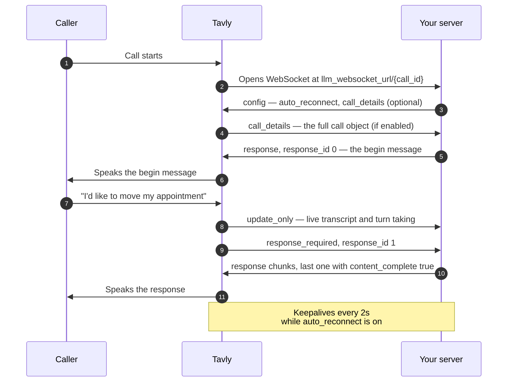

With a custom LLM integration, your backend retains complete control over dialogue generation, decision logic, and data handling. Tavly manages carrier-grade telephony, real-time speech-to-text (ASR), acoustic turn-taking detection, and text-to-speech (TTS) voice synthesis. For each call, Tavly opens a bidirectional WebSocket connection to your server, transmitting live transcripts and requesting tokens as the conversation unfolds.

<Note>
  For the vast majority of voice applications, we recommend starting with [single prompt](/build/setup/single-multi-prompt/write-single-prompt) or [conversation flow](/build/setup/conversation-flow/conversation-flow-overview) agents. Native frameworks automatically receive platform updates, provide visual testing tools, and come pre-tuned for ultra-low latency.
</Note>

---

## What is a custom LLM voice agent and how does the architecture work?

A **custom LLM architecture** connects your self-hosted or proprietary language model directly to Tavly over a persistent full-duplex WebSocket. While your server generates conversational tokens and executes business logic, Tavly handles carrier telephony, low-latency speech recognition, acoustic turn-taking, and text-to-speech voice synthesis in real time.

This division of labor combines enterprise telephony infrastructure with custom model execution:

* **Tavly Infrastructure Layer**: Manages SIP trunks, WebRTC browser connections, audio encoding/decoding, carrier signal normalization, acoustic speech endpointing, and ultra-fast voice synthesis.
* **Your Application Server Layer**: Evaluates incoming conversation transcripts, runs proprietary Retrieval-Augmented Generation (RAG) pipelines, maintains business state, queries internal databases, and streams completion chunks back over the socket.

---

## When should you use a custom LLM instead of native prompt frameworks?

Choose a custom LLM when strict **regulatory compliance** requires processing conversational data within private infrastructure, when serving **fine-tuned or self-hosted open-weights models**, or when implementing complex multi-agent orchestration beyond native prompt interfaces. Standard applications should use native single prompt or conversation flow agents for lower maintenance overhead.

Native [single prompt](/build/setup/single-multi-prompt/write-single-prompt) and [conversation flow](/build/setup/conversation-flow/conversation-flow-overview) frameworks provide turnkey tool calling, integrated [knowledge base retrieval](/build/context/knowledge-base), warm transfers, and browser-based testing consoles with zero server infrastructure to maintain.

### Primary architectural drivers for custom LLMs

1. **Strict regulatory and data sovereignty constraints**: Your compliance mandates (e.g., HIPAA, GDPR, SOC 2, PCI-DSS) require that conversation transcripts and system prompts remain strictly within your Virtual Private Cloud (VPC) or on-premise hardware.
2. **Proprietary or fine-tuned model architectures**: You utilize domain-specialized weights, self-hosted open-source models (such as Llama 3 or Mistral via vLLM), or upstream model providers outside Tavly's natively managed list.
3. **Complex multi-agent business orchestration**: Your application requires multi-hop reasoning loops, dynamic tool selection matrices, or external orchestration pipelines that already live in proprietary codebases.

### Operational tradeoffs and framework limitations

When selecting a custom LLM, your team assumes responsibility for network latency, server uptime, model concurrency, and connection reconnects. You also bypass features that assume Tavly hosts the model:

* **Visual testing limitations**: The visual [LLM playground](/test/llm-playground) and automated [batch testing suites](/test/test-overview) cannot simulate custom LLM agents; live web calls or phone calls are required for end-to-end testing.
* **Automated agent transfer restrictions**: Native [agent transfer tools](/build/setup/single-multi-prompt/agent-transfer-tool) cannot hand off directly to a custom LLM agent.
* **Transcript telemetry**: Your server's internal tool executions only appear in call transcripts if you [explicitly emit telemetry events](/integrate-llm/integrate-function-calling#how-do-you-record-and-weave-tool-call-events-into-the-call-transcript). Tavly records carrier actions (`end_call`, `transfer_number`, `digit_to_press`) automatically.

---

## How does a voice call flow over the bidirectional WebSocket connection?

Each telephone call initiates a dedicated WebSocket connection from Tavly to your server URL with the unique `call_id` appended. Tavly streams live user utterances and issues **`response_required`** events; your backend streams partial completion deltas, concluding each turn with **`content_complete: true`** to trigger audio vocalization.

The sequence diagram below illustrates the full-duplex message lifecycle during an active telephone call:

<Note>
  Tavly controls acoustic turn-taking. If a caller pauses mid-thought and resumes speaking before audio vocalization starts, Tavly discards the pending response and issues a new `response_required` event with an incremented `response_id`.
</Note>

---

## What protocol message types must your custom WebSocket server implement?

Your server receives five core inbound `interaction_type` messages: **`response_required`**, **`reminder_required`**, **`update_only`**, **`call_details`**, and **`ping_pong`** keepalives. In return, your backend responds using structured `response_type` payloads—streaming text deltas via **`response`**, executing telephony actions, and emitting tool telemetry to ensure comprehensive transcript logging.

### Inbound messages from Tavly (`interaction_type`)

| `interaction_type` | Server Requirement | Operational Role & Payload Data |
| :--- | :--- | :--- |
| **`response_required`** | Must reply with `response` | Carries the live `transcript` and a numeric `response_id`. Tavly is waiting for speech tokens to synthesize audio. |
| **`reminder_required`** | Must reply with `response` | Identical schema to `response_required`, but sent when the caller has fallen silent and Tavly requests a conversational check-in nudge. |
| **`update_only`** | Informational (No reply needed) | Real-time transcript updates, endpointing events, and turn-taking status changes. |
| **`call_details`** | Informational (No reply needed) | Transmits the complete call object, including caller metadata and [dynamic variables](/build/context/dynamic-variables). Sent on socket open if enabled in `config`. |
| **`ping_pong`** | Must echo back | Periodic keepalive timestamp sent every 2 seconds when `auto_reconnect` is enabled. |

### Outbound messages from your server (`response_type`)

| `response_type` | Requirement Level | Operational Role & Capabilities |
| :--- | :--- | :--- |
| **`response`** | Mandatory | Streams content text deltas for speech synthesis. Can optionally attach `end_call`, `transfer_number`, or `digit_to_press` commands. |
| **`config`** | Optional (Recommended) | Transmitted immediately upon connection to enable keepalive monitoring, request `call_details`, or turn on transcript tool logging. |
| **`ping_pong`** | Mandatory if keepalives active | Echoes the timestamp received from Tavly to confirm socket health. |
| **`agent_interrupt`** | Optional | Commands Tavly to immediately interrupt any ongoing speech or silence, vocalizing new content instantly. |
| **`tool_call_invocation` / `tool_call_result`** | Optional | Interweaves tool call names, arguments, and outcomes directly into the official call transcript. |
| **`update_agent`** | Optional | Modifies speech responsiveness, interruption sensitivity, or reminder delays dynamically mid-call. |
| **`metadata`** | Optional | Passes arbitrary JSON payloads to connected web call client frontends. |

<Warning>
  Always explicitly define `response_type` on every message your server dispatches. While Tavly defaults omitted types to `response` for backwards compatibility, missing types make malformed payloads fail silently without throwing schema errors.
</Warning>

---

## What example reference servers and SDKs are available for custom LLMs?

Tavly provides production-ready, open-source reference implementations in both **Node.js (Express)** and **Python (FastAPI)**. These templates demonstrate end-to-end WebSocket lifecycle management, real-time token streaming, tool call invocation, and interruption handling across leading model providers including OpenAI, Azure OpenAI, Anthropic Claude, and OpenRouter.

Review our official demo repositories to accelerate your implementation:

* **Node.js Reference Implementation**: [Retell Custom LLM Node.js Demo](https://github.com/RetellAI/retell-custom-llm-node-demo) — Supports OpenAI, Azure OpenAI, and OpenRouter with full TypeScript typing.
* **Python Reference Implementation**: [Retell Custom LLM Python Demo](https://github.com/RetellAI/retell-custom-llm-python-demo) — Async FastAPI implementation supporting OpenAI and Anthropic Claude.

<Note>
  While reference repositories illustrate core mechanics, always cross-reference the detailed guides in this documentation section for the latest protocol specifications and reliability best practices.
</Note>

---

## Frequently asked questions about custom LLM voice agent architecture

Custom LLM agents allow organizations to retain full ownership over response generation while leveraging Tavly's enterprise telephony and voice synthesis infrastructure. By streaming token deltas over WebSockets, managing turn-taking events, and implementing strict idempotency, developers achieve sub-second conversational latency tailored to complex proprietary requirements.

<AccordionGroup>
  <Accordion title="How does Tavly coordinate with my custom LLM server during a live phone call?">
    Tavly establishes a dedicated WebSocket connection directly to your server endpoint upon call initiation. As the caller speaks, Tavly transcribes the audio and transmits `response_required` events. Your server streams completion deltas back over the socket, and Tavly immediately vocalizes them through its text-to-speech engine.
  </Accordion>

  <Accordion title="When should I build a custom LLM server instead of using native Tavly prompt frameworks?">
    Deploy a custom LLM server when compliance mandates require processing data inside your private VPC, when serving proprietary or self-hosted open-weights models, or when conversational logic requires complex multi-step orchestration that cannot be represented in standard prompts.
  </Accordion>

  <Accordion title="What happens if a caller speaks while my custom LLM is generating a response?">
    Tavly detects speech interruption, discards the in-flight response, and issues a new request with an incremented `response_id`. Your server must track the active `response_id` and abort stale generation loops to conserve compute and prevent delayed audio playback.
  </Accordion>

  <Accordion title="Can I test custom LLM agents using the visual LLM playground?">
    No. Custom LLM agents decouple response generation from Tavly's managed infrastructure, making them incompatible with the visual LLM playground and batch simulators. Test your server directly using simulated web calls in your browser or live telephone calls.
  </Accordion>
</AccordionGroup>

---

## Next steps

<CardGroup cols={2}>
  <Card title="Set Up Your WebSocket Server" icon="server" href="/integrate-llm/setup-websocket-server">
    Establish the foundational WebSocket server connection and handle protocol events.
  </Card>

  <Card title="Connect Your LLM" icon="plug" href="/integrate-llm/integrate-llm">
    Stream live completions, build prompts from transcripts, and handle superseded responses.
  </Card>

  <Card title="Add Function Calling" icon="code-branch" href="/integrate-llm/integrate-function-calling">
    Enable your custom LLM agent to book appointments, transfer calls, and press IVR digits.
  </Card>

  <Card title="LLM Best Practices" icon="lightbulb" href="/integrate-llm/llm-best-practice">
    Optimize time to first sentence, engineer speech-first prompts, and build for resilience.
  </Card>
</CardGroup>
