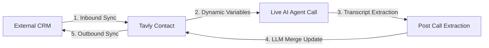

## What is persistent contact memory and how does it work?

**Persistent contact memory** enables Tavly AI agents to retain customer preferences, past resolutions, and outstanding commitments across multiple conversations without an external vector database. Following every call or chat, **Post Call Extraction** extracts structured insights and writes them into unified contact attributes via the **Merge** update mode for subsequent sessions.

When an agent dials or receives a call from that contact in the future, the accumulated memory is injected directly into the agent's LLM prompt as [dynamic variables](/build/context/dynamic-variables), enabling deeply personalized, context-aware conversations.

### Key Capabilities of Persistent Memory

* **Zero-Database Memory Infrastructure**: Eliminate the need to provision, manage, and index third-party vector databases or retrieval pipelines for persistent customer recall.
* **Autonomous Profile Enrichment**: Every conversation refines the contact's persistent record, updating changed preferences and logging interaction summaries.
* **Workspace-Wide Context Sharing**: Memory accumulates at the workspace level, ensuring that multi-agent architectures (e.g., triage agents and specialist booking agents) share identical customer recall.

***

## How does the contact memory processing pipeline operate?

The contact memory pipeline executes in three automated stages: first, **Post Call Extraction** mines conversation transcripts for structured insights; second, **analysis data mappings** apply LLM-driven update modes to consolidate new data into contact profiles; third, future voice calls automatically inject updated contact fields into agent prompts as **dynamic variables**.

<Steps>
  <Step title="Post Call Extraction captures structured conversation data">
    Immediately after each call or chat session concludes, your agent's [Post Call Extraction](/monitor/post-call-analysis-create) pipeline parses the transcript to extract specific structured entities—such as customer preferences, stated objections, action items, or budget constraints.
  </Step>

  <Step title="Analysis data maps to unified contact fields">
    Extracted data writes directly to contact attributes using configured [analysis data mappings](/integrations/crm/crm-data-mappings). The deterministic **Merge** update mode governs how new conversation data combines with existing customer history.
  </Step>

  <Step title="Contact fields inject as dynamic variables on subsequent calls">
    When the contact connects via telephony in a future session, all accumulated contact attributes automatically inject into the agent's prompt context as [dynamic variables](/build/context/dynamic-variables). Note that while web chats write back to contact attributes, they do not currently receive contact attributes as runtime variables.
  </Step>
</Steps>

### The Role of the LLM Merge Update Mode

The **Merge** update mode (labeled **Accumulate & summarize** in the dashboard) is the foundational engine of contact memory. Unlike **Overwrite** (which erases prior history) or **Fill if empty** (which records data only once), Merge uses an LLM to synthesize historic values with new transcript insights. It deduplicates repetitive statements, resolves contradictions, and preserves chronological context in a single cohesive record.

***

## How do you configure persistent contact memory step-by-step?

To implement persistent memory, define structured extraction variables under **Post Call Extraction**, create custom string fields on the **Contacts** page with LLM merge prompt descriptions, map extraction outputs to those attributes using **Merge (Accumulate & summarize)**, and reference memory fields in agent prompts using double curly bracket variable syntax.

Follow these implementation steps:

### Step 1: Define Post Call Extraction Fields

Configure extraction attributes under your agent's **Post Call Extraction** tab to target the exact qualitative details your agent must remember across interactions.

| Extraction Field Name | Field Type | Extraction Prompt Objective |
| :--- | :--- | :--- |
| `customer_preferences` | Text | Extract any stated preferences, scheduling constraints, or product requirements mentioned by the caller. |
| `key_topics` | Text | Summarize the primary topics discussed, decisions agreed upon, and overall call outcome. |
| `action_items` | Text | Extract all follow-up commitments, promised deliverables, and assigned next steps. |
| `objections` | Text | Capture any hesitations, pricing objections, or competitor comparisons raised by the customer. |

<Tip>
  **Write Explicit Extraction Prompts**: Avoid generic instructions like *"Summarize the call."* Instead, provide deterministic criteria: *"Extract the customer's stated budget, target implementation date, and technical constraints mentioned during the conversation."*
</Tip>

### Step 2: Create Custom Contact Fields with Merge Instructions

Navigate to the [Contacts](/features/contacts) page, open **Actions → Manage contact fields**, and create custom fields of type `string`. The description you write serves as the system prompt for the merge LLM:

| Custom Field Name | Data Type | LLM Merge Prompt Instruction |
| :--- | :--- | :--- |
| `preferences` | `string` | A consolidated list of this contact's preferences and requirements across all conversations. When merging, update changed preferences and keep unchanged ones. Deduplicate. Format as a bullet list. |
| `interaction_history` | `string` | A running summary of all conversations with this contact. Include key topics, decisions, and outcomes. Keep the most recent interaction prominent while preserving important context from earlier conversations. Limit to the 10 most recent interactions. |
| `pending_actions` | `string` | Outstanding action items and commitments. When merging, mark completed items as done if the new conversation indicates completion. Add new action items. Remove items that are no longer relevant. |
| `objections_and_concerns` | `string` | A deduplicated list of objections or concerns raised across all conversations. When merging, add new concerns without repeating existing ones. Note if a previously raised concern has been resolved. |

<Warning>
  **Field Descriptions Determine Merge Quality**: When using the Merge update mode, the field description functions as the explicit instruction prompt evaluated by the LLM. Review the [How Merge Works](/integrations/crm/crm-data-mappings#how-merge-works) guide for prompt structures and constraints.
</Warning>

### Step 3: Map Analysis Extraction Fields to Contact Fields

Under **Actions → Manage contact fields**, establish post-call data mappings that connect each extraction variable to its corresponding contact attribute, setting the update mode to **Merge**:

| Post Call Extraction Attribute | Direction | Target Contact Field | Update Mode |
| :--- | :---: | :--- | :--- |
| `customer_preferences` | → | `preferences` | **Merge (Accumulate & summarize)** |
| `key_topics` | → | `interaction_history` | **Merge (Accumulate & summarize)** |
| `action_items` | → | `pending_actions` | **Merge (Accumulate & summarize)** |
| `objections` | → | `objections_and_concerns` | **Merge (Accumulate & summarize)** |

<Note>
  Analysis data mappings are enforced at the **organization level**. When any agent in your workspace generates a mapped extraction field, the value merges into the shared contact record automatically.
</Note>

### Step 4: Inject Contact Memory into Agent Prompts

Reference your custom contact memory fields in your agent's system prompt using standard [dynamic variable](/build/context/dynamic-variables) notation:

```markdown
You are a senior support concierge for Tavly Enterprise.
The caller's name is {{first_name}} {{last_name}}.

Customer Memory Profile:
- Known Preferences: {{preferences}}
- Interaction History: {{interaction_history}}
- Outstanding Action Items: {{pending_actions}}
- Prior Objections / Concerns: {{objections_and_concerns}}

Instructions:
Review the customer's prior interaction history and preferences. If they have outstanding action items, ask if they would like an update on those items before proceeding. Never repeat previously resolved objections unless the customer reintroduces them.
```

***

## How do you sync accumulated contact memory back to your CRM?

To synchronize memory across your revenue stack, configure **outbound sync mappings** that push Tavly custom fields directly into Salesforce custom properties (`AI_Interaction_Notes__c`) or HubSpot properties (`customer_preferences`). This creates a closed data loop: CRM data informs live calls, and post-call LLM synthesis writes back updated intelligence automatically.

When connected to a CRM such as [Salesforce](/integrations/crm/salesforce/connect) or [HubSpot](/integrations/crm/hubspot/connect), map your accumulated contact fields to custom CRM properties:

| Tavly Contact Field | Direction | External CRM Property (Salesforce / HubSpot) |
| :--- | :---: | :--- |
| `preferences` | → | `Customer_Preferences__c` / `customer_preferences` |
| `interaction_history` | → | `AI_Interaction_Notes__c` / `ai_interaction_notes` |
| `pending_actions` | → | `Pending_Actions__c` / `pending_actions` |

This architecture establishes a closed-loop customer intelligence cycle:



Review the [CRM data mappings guide](/integrations/crm/crm-data-mappings) for complete configuration parameters governing outbound sync triggers.

***

## What best practices ensure high-accuracy contact memory?

To maximize memory accuracy, separate memory into distinct categorical fields, supply detailed **LLM merge instructions** in field descriptions with strict size limits (e.g., "Keep under 500 words"), reserve **Overwrite** for transient statuses, and utilize the **batch rerun feature** to backfill historical call data into contact records.

* **Isolate Categorical Attributes**: Avoid consolidating all conversation context into a single monolithic field. Separate history, preferences, and action items into dedicated attributes to keep prompt injection clean and targeted.
* **Enforce Size Boundaries in Merge Descriptions**: Without structural limits, free-form text fields expand indefinitely. Include bounded instructions in the field description (e.g., *"Maintain a chronological summary of the 5 most recent calls; prune older details once total length exceeds 300 words"*).
* **Reserve Overwrite for Dynamic States**: Use the **Overwrite** mode for volatile operational statuses (such as `lead_status` or `account_tier`) that must reflect only the latest conversation state.
* **Use Fill If Empty for Immutable Identifiers**: Apply **Fill if empty** for stable profile attributes like personal emails or company domains to protect validated data against conversational transcription errors.
* **Backfill from Call Archives**: If implementing memory on an existing workspace with conversation history, use the [batch rerun feature](/monitor/rerun-call-analysis) to process archived transcripts and populate contact fields immediately.
* **Validate with Multi-Call Simulations**: Before deploying to production, execute multiple simulated test calls against the same contact phone number and verify on the contact record that summaries merge cleanly without repetitive duplication.

***

## Frequently Asked Questions

<AccordionGroup>
  <Accordion title="Does persistent contact memory work across both voice calls and web chats?">
    Post Call Extraction and contact field updates run after both phone calls and web chats. However, accumulated contact fields are injected as dynamic variables exclusively during voice phone calls.
  </Accordion>

  <Accordion title="Is contact memory shared across different agents in the same workspace?">
    Yes. Analysis data mappings are configured at the workspace level, meaning contact attributes accumulate unified memory regardless of which agent in your workspace handled the conversation.
  </Accordion>

  <Accordion title="How does the Merge mode prevent contact fields from exceeding context token limits?">
    Merge operations are capped at approximately 512 tokens. By instructing the LLM within the field description to prune outdated details or maintain a bulleted list, memory remains concise and relevant.
  </Accordion>

  <Accordion title="Can I backfill contact memory from conversations that occurred before memory was configured?">
    Yes. You can use the batch rerun feature on historical call logs to extract structured fields and populate persistent contact memory retroactively.
  </Accordion>
</AccordionGroup>
