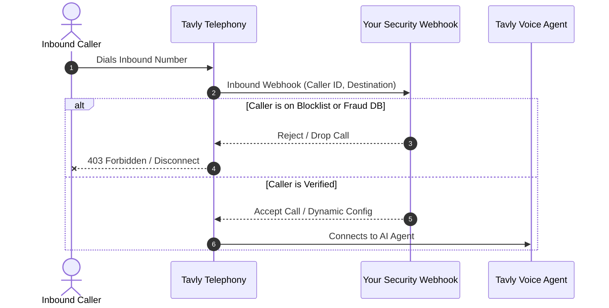

## What is telephony abuse and International Revenue Sharing Fraud (IRSF)?

**International Revenue Sharing Fraud (IRSF)** is a telecom exploit where fraudsters generate massive call or SMS volumes to high-cost premium international numbers to collect carrier kickbacks. Bad actors target public call widgets and forms using **rotated destination numbers** and **pre-recorded audio** to drain balances and abuse telephony infrastructure.

Tavly AI implements multi-layered security controls to protect conversational agents from exploitation. However, public-facing interfaces—such as browser call buttons, click-to-call forms, and published telephone numbers—can be targeted by attackers posing as legitimate users.

### Common Telecom and AI Abuse Scenarios

Fraudsters typically design automated scripts and bots to exploit telephony channels for financial gain or service disruption:

| Abuse Vector | Primary Attack Mechanism | Attacker Incentive | Impact & Risk Level |
| :--- | :--- | :--- | :--- |
| **Excessive Outbound Calling (IRSF)** | Automated scripts trigger calls to high-cost, non-US numbers via public call widgets or lead forms using rotated numbers and human voice recordings. | Carrier kickback revenue sharing on premium international destination rates. | **Critical**: High telecom billing spikes and API quota exhaustion. |
| **Outbound SMS & 2FA Pumping** | Rapid generation of SMS messages or 2FA verification texts to premium foreign rate bands. | Payout shares from colluding mobile network operators (MNOs). | **High**: Rapid SMS toll budget depletion. |
| **Inbound Call Spam Flooding** | High-volume robocall dialing into publicly displayed business phone numbers. | Service denial (DDoS) or harassment (rarely generates kickbacks directly). | **Medium**: Agent capacity exhaustion and high incoming call charges. |
| **Chat & Voice Widget Bot Spam** | Headless browsers and botnets flooding web chat or voice streaming endpoints. | Platform disruption, prompt injection testing, or server resource exhaustion. | **Medium**: Resource consumption and polluted conversational analytics. |

***

## What are the best practices for preventing voice agent abuse?

To prevent voice agent abuse, enforce **backend-only secret API keys**, use **reCAPTCHA-protected public keys** on frontend widgets, restrict **dialing destinations to allowed regions**, and implement **IP and phone number rate limits**. Additionally, add user verification (KYC) and configure agent prompts to rapidly detect and terminate irrelevant calls.

Apply these seven foundational security rules across your deployment lifecycle:

1. **Keep Secret API Keys Private**: Never embed your primary Tavly API secret key in client-side code, mobile binaries, or client-accessible repositories. Always use a restricted [public key](/accounts/keys/public-keys) for frontend components.
2. **Rotate Exposed Credentials**: If a private API key is ever exposed or committed publicly, rotate and revoke the credential immediately in the Tavly dashboard.
3. **Deploy Bot Mitigation**: Enable Google reCAPTCHA v3 or equivalent verification on all public web widgets and lead-generation forms.
4. **Enforce Geographic Restrictions**: Restrict outbound calling destinations exclusively to the countries and regional dial codes required by your business operations.
5. **Implement Multi-Tier Rate Limiting**: Apply request limits per client IP address, target phone number, and authenticated user account session.
6. **Implement KYC & Identity Verification**: Require phone verification (OTP), email confirmation, or account login before initiating outbound phone calls.
7. **Configure Prompt-Level Guardrails**: Equip your agent system prompt with explicit instructions to detect automated recordings or off-topic prompts and hang up immediately.

***

## How do you secure outbound calling and web chatting capabilities?

Secure public outbound and chat capabilities by routing all call creation requests through your **authenticated backend** or by embedding **Tavly web widgets** protected by **Google reCAPTCHA v3**. Restrict frontend operations to public keys with strict domain allowlists and quota limits to prevent automated bot exploitation.

Depending on your application architecture, implement one of two hardened deployment models:

### Architecture 1: Backend-Controlled Calling (Recommended)

Manage user sessions on your private backend application and keep all Tavly API calls entirely server-side:

* **Authentication & Authorization**: Require users to log in through your Identity Provider (IdP) and verify session credentials before exposing calling capabilities.
* **Backend Validation**: Validate destination numbers against country allowlists and database records before invoking Tavly outbound dial APIs.
* **Server-to-Server API Calls**: Store your secret Tavly API key in server environment variables, completely hidden from browsers and mobile clients.

### Architecture 2: Hardened Client-Side Widgets

If embedding voice or chat directly into client-side web apps:

* **Use Restricted Public Keys**: Provision scoped [public keys](/accounts/keys/public-keys) with configured origin domain whitelists and allowed agent IDs.
* **Enable Google reCAPTCHA v3**: Embed [Google reCAPTCHA v3 protection](/accounts/keys/public-keys#google-recaptcha-v3-protection-optional) on the [Tavly chat widget](/deploy/chat-widget) or call widget to score incoming traffic and automatically block headless scripts.
* **Client-Side Concurrency Caps**: Restrict simultaneous active calls per browser session to prevent concurrent session abuse.

***

## How do you screen and block unwanted inbound spam calls?

Screen inbound spam by deploying **inbound call webhooks** that validate the caller's phone number before connecting to an agent. Your webhook receives real-time caller data, cross-references internal blocklists or reputation databases, and programmatically returns instructions to accept, redirect, or drop malicious calls immediately.

When a public phone number receives an inbound call, Tavly sends an HTTP POST event to your configured endpoint before bridging audio:

### Inbound Defense Mechanisms

* **Real-Time Blocklist Evaluation**: Configure [inbound call webhooks](/deploy/inbound-call-webhook) to screen the incoming `from_number` against known robocall databases (e.g., Twilio Lookup, carrier spam databases, or your custom CRM blacklist).
* **Instant Hangup on Fraud**: If a calling number matches malicious patterns or exceeds incoming velocity thresholds, return an immediate hangup or rejection response to prevent agent charges.
* **Interactive IVR Gatekeeping**: Force first-time callers through a brief DTMF challenge (e.g., "Press 1 to speak with an agent") before dispatching to an LLM voice agent.

***

## How do advanced fraud protection controls mitigate telecom risks?

Advanced fraud protection mitigates telecom risks by enforcing **granular per-phone-number geographic routing**, **IP-based velocity limits**, and **destination call caps**. Configuring strict per-country dialing policies and concurrency limits halts automated toll fraud spikes before unexpected carrier charges or API exhaustion occur.

| Protection Layer | Basic Implementation | Advanced Telephony Guardrails |
| :--- | :--- | :--- |
| **Geographic Filtering** | General regional awareness | Hard country-code whitelisting per telephone number and blocking high-risk IRSF destination codes. |
| **Velocity & Rate Limiting** | Single API key quotas | Per-IP, per-destination number, and per-minute sliding window rate limiting. |
| **Bot Mitigation** | Captcha on form submit | Silent Google reCAPTCHA v3 enterprise risk evaluation integrated into widget session tokens. |
| **Agent Behavior** | Default polite conversation | System prompts trained to disconnect when silence, hold music, or automated IVR loops are detected. |

For detailed instructions on configuring granular rate limiting by IP, restricting country destinations per number, and setting concurrency thresholds, review our dedicated guide on [Fraud Protection](/reliability/fraud-protection).
